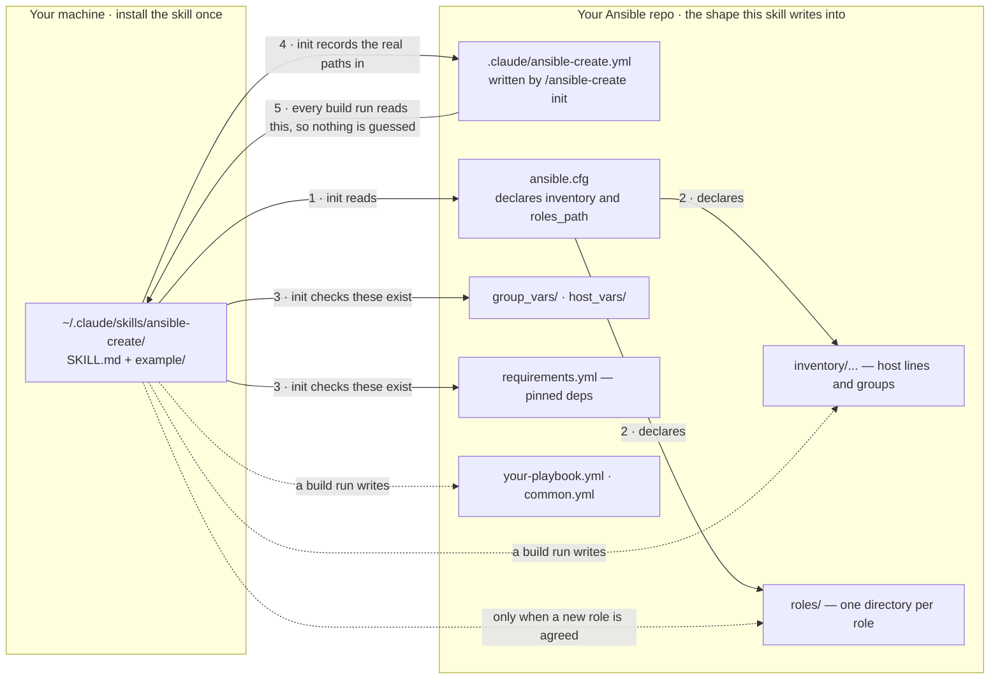
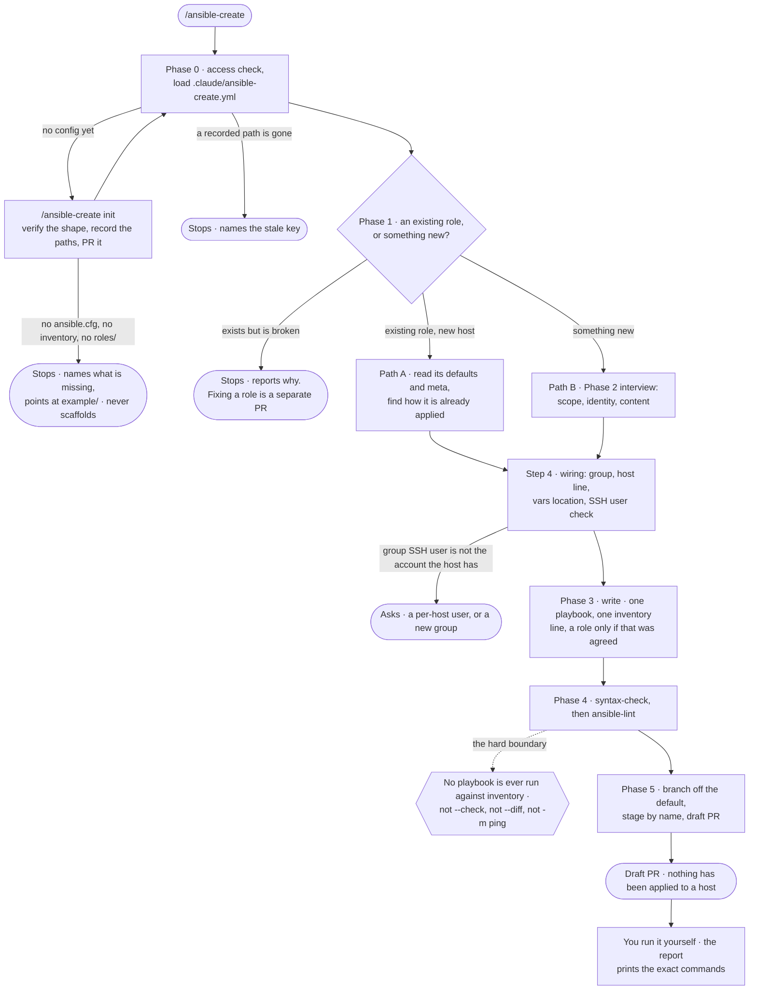

# ansible-create

The other half of [`terraform-create`](../terraform-create). That skill stops at a printed
tfvars entry and a host line; this one turns a host into working automation and a draft PR.

It writes the minimal playbook and inventory line on a branch off your default branch,
verifies with `--syntax-check` and `ansible-lint` only, and opens a draft PR. It **never runs
a playbook against real inventory** — not even `--check`.

**Repo-driven.** Which inventory file, which roles directory, which branch to cut from, which
commands verify the result, what the repo's own naming looks like — all of it comes from a
`.claude/ansible-create.yml` committed to your Ansible repo. The skill hardcodes no path.
`/ansible-create init` checks your repo actually has the shape this skill needs, then writes
that file from what it found.

---

## Before you start

This skill writes *into* an Ansible repo. It does not create one, and it will stop rather
than scaffold.

| | Why |
|---|---|
| An Ansible repo with **`ansible.cfg`**, an **inventory file**, and a **`roles/` directory** | These three are load-bearing. `init` checks for them by name and stops if any is missing. [`example/`](example/) is a working one to copy if you don't have one |
| `group_vars/` and a `requirements.yml` alongside them | Wanted, not fatal. Without them there's nowhere to put a group-scoped var and no pinning story — `init` records their absence instead of inventing them |
| `git`, and `gh` authenticated **with write access** | Both `init` and every build run push a branch and open a PR |
| `ansible-core` and `ansible-lint` reachable — on PATH, or installable into a scratch venv | Phase 4 is the only thing that verifies the output. `init` settles which of the three situations you're in and records it |
| Network to PyPI, if the venv route is the one you're on | That's how the scratch venv gets built |
| Claude Code | Not a chat skill |
| Optional: the Terraform repo that provisioned the host | Lets it confirm the host exists and read its IP rather than asking again |

Ansible is often **not** installed in a Claude Code session image, and `pip install` into
system Python can break — one image's preinstalled `cryptography` raises
`pyo3_runtime.PanicException` on import. That's what the scratch venv is for. If neither
route works, `init` says so and asks whether to continue knowing both checks will report
`not run` on every run — it finds that out **before** anything is written, not at Phase 4
with the files already on disk.

---

## Where the files go

Two different `.claude` things in two different places, plus the repo shape that has to
already exist:



- **The skill** is a folder you copy once. It is the same for every project.
- **The config** is one small YAML file per Ansible repo, and it is the only project-specific
  thing that exists.
- **Everything else in that box has to already be there.** `init`'s whole job on first run is
  to check it is, and to record where each piece actually lives — not where an example put it.

---

## Install

### Step 1 — copy the skill

```bash
git clone https://github.com/dawg-io/claude-skills.git
cd claude-skills

# personal — available in every project (recommended)
mkdir -p ~/.claude/skills
cp -r ansible-create ~/.claude/skills/

# or project-scoped — checked in alongside the Ansible repo it writes into
mkdir -p /path/to/your-ansible-repo/.claude/skills
cp -r ansible-create /path/to/your-ansible-repo/.claude/skills/
```

Start a new Claude Code session — skills are picked up at session start, not live. Confirm it
loaded by typing `/` and looking for `ansible-create` in the list.

`example/` travels with the skill, so a copied skill folder always has the reference repo
next to it.

### Step 2 — if you don't have an Ansible repo yet

[`example/`](example/) is a working minimal one laid out exactly the way this skill expects:
`ansible.cfg`, an INI inventory, `group_vars/`, a fleet-wide `common.yml`, a root playbook in
house style, one worked role, and a pinned `requirements.yml`.

```bash
cp -r ansible-create/example ~/my-infra/ansible && cd ~/my-infra/ansible
ansible-galaxy install -r requirements.yml
ansible-inventory --list          # run from the repo root — see the traps in its README
```

It's the counterpart to [`terraform-create/example/`](../terraform-create/example/), and the
two compose — build a VM with one, manage it with the other. Its `ubuntu_servers` group lines
up with the key-only `ansible` account that module creates, which is the mismatch that
otherwise fails every play at connection.

**On Galaxy:** the command users run is `ansible-galaxy install -r requirements.yml`.
`ansible-galaxy role import <user> <repo>` is a *publisher* command needing an API token, and
standalone roles are being retired in favour of collections — `example/README.md` has the
detail.

The skill itself will never do this copy for you unprompted. A missing `ansible.cfg` is a
stop, not a build task.

### Step 3 — set up the repo

From inside your Ansible repo:

```
/ansible-create init
```

It reads the repo rather than quizzing you. It checks the three load-bearing pieces are
there, pulls `inventory`, `roles_path` and `collections_path` straight out of `ansible.cfg`,
reads your real host-line shape and group/role casing out of the files themselves, greps your
playbooks to find out whether plays are named (which is what decides whether `name[play]` is a
finding or your house style), greps `.github/workflows/` to find out whether CI lints, and
asks only the handful of things it genuinely can't read.

Then it writes `.claude/ansible-create.yml`, shows it to you in full, **validates it** —
`ansible-lint --version`, `ansible-playbook --version`, and an `ansible-inventory --list`
against the path it just recorded — commits that one path on a branch cut from your default
branch, and opens a PR. It merges that PR only if you say yes.

You can write the file by hand instead — see [Configuration](#configuration) — but `init`
derives the paths from your actual `ansible.cfg`, which is the part that's easy to get wrong
and expensive to get wrong: a config naming an inventory that doesn't exist turns a clean stop
into a host line written to a file nothing reads.

### Step 4 — build

```
/ansible-create
```

---

## What a real run looks like

The first fork is the one that decides everything after it: is this a role the repo already
has, or something new?



**Path A is meant to be short.** One inventory line and a group membership is the correct
outcome when the role already exists — not a sign the skill did too little. Path B is the
build, and it's the one worth the interview.

The dotted node is the boundary the whole skill is shaped around: verification is
`--syntax-check`, `--list-tasks`, `ansible-lint` and `ansible-inventory --list`, and nothing
else. Even `--check` opens SSH and gathers facts, so it's out. What lands is a draft PR and a
report with the exact commands for **you** to run against the host.

### When it stops on you

| It says | What happened | What you do |
|---|---|---|
| **Not an Ansible repo** | `init` found no `ansible.cfg`, no inventory file, or no `roles/` | Point it at a real repo, or copy [`example/`](example/) and edit it. It won't scaffold one for you |
| **A config already exists** | `.claude/ansible-create.yml` is already there | It shows you the file first. Say update or keep — it never overwrites one you haven't seen |
| **No ansible tooling** | Neither system `ansible-playbook`/`ansible-lint` nor a buildable venv | Say whether to continue anyway. If you do, both checks report `not run` on every run — honestly, rather than fabricated |
| **A recorded path is gone** | The repo moved its inventory or roles dir since `init` ran | Fix that one key, or re-run `init`. It stops rather than guessing a replacement |
| **This already exists and is broken** | Phase 1 found the capability already wired up and failing | That's a debugging job, not a build. The report says what it found wrong |
| **It would need a role edit** | An existing role nearly covers it, but needs a new tunable | Your call. A new tunable is a separate PR, and it changes behaviour for every host already using that role |
| **SSH user mismatch** | The group's `ansible_ssh_user` isn't the account the image actually has | Pick a per-host `ansible_ssh_user=` on the inventory line, or a new group. It won't edit the existing `:vars` block, which would move every other host in that group |
| **Branch already exists** | `add-<name>` is taken | Give it another name. It uses `git checkout -b`, never `-B`, so it won't reset your earlier branch |
| **Reboot or address change** | The work would change the node's address mid-run | Agree to the two-play shape first. It's the one step that can strand a node behind the console |
| **A secret got pasted in chat** | You put a token in the conversation | Rotate it. The skill writes an empty default plus a `CHANGEME` assert, never the literal |

---

## The two modes

| You type | It does | It writes |
|---|---|---|
| `/ansible-create init` | Verifies the repo's shape, records its real paths and conventions, opens a PR for the config | One file, on a branch, after you've seen it |
| `/ansible-create` | The build, Phases 0–5 | A playbook, an inventory line, sometimes a role — on a branch, in a draft PR |

Plain `/ansible-create` in a repo with no config routes into `init` first and says so, then
carries on into the build.

### When it triggers

- `/ansible-create`, `/ansible-create init`, "ansible create"
- Asking for a playbook or role for a node, or to apply an existing role to a new host
- Asking to wire a new VM into Ansible
- Handing over a tfvars entry and saying "now the ansible side" — **even without saying "role" or "playbook"**
- "set up ansible-create", "configure ansible-create" → init

Not for debugging a failing run, or for a Talos/Kubernetes cluster with its own tooling.

---

## Configuration

The whole project-specific surface is one file, in the Ansible repo:

```yaml
version: 1

repo:
  default_branch: main            # discovered, never assumed — branches are cut from this
  branch_prefix: add-             # a build run's branch is <prefix><name>

paths:
  ansible_cfg: ansible.cfg
  inventory: inventory/home/host  # the file host lines are written to
  roles_dir: roles
  group_vars_dir: group_vars
  host_vars_dir: host_vars        # omit if the repo has none
  requirements: requirements.yml  # omit if the repo has none
  fleet_playbook: common.yml      # omit if there is none
  playbook_dir: .                 # where root playbooks live

conventions:
  host_line: "{hostname} ipv4={ip}"
  group_case: snake_case
  role_dir_case: kebab-case
  role_var_prefix: role_subject   # role vars start with the role's subject
  vars_location: role_defaults    # role_defaults | group_vars | host_vars
  plays_named: false              # false = unnamed plays are house style
  model_on: roles/chrony          # the role a new one is modeled on

verify:
  ansible_from: venv              # system | venv | unavailable
  syntax_check: "ansible-playbook --syntax-check {playbook}"
  lint: "ansible-lint --offline"
  lint_dir: temp                  # repo | temp — where lint is run from
  lint_enforced_by_ci: false
  allowed_lint_rules: ["name[play]"]   # left in place, with the reason, every run
```

`version`, `repo`, `paths`, `conventions` and `verify` are all required. Four keys inside
them are optional, and omitting one means "the repo doesn't have this": `paths.host_vars_dir`,
`paths.requirements`, `paths.fleet_playbook`, and `conventions.model_on` — leave that last one
out when `roles/` is empty, and Phase 2 falls through to its "nothing close enough to model on"
stop rather than inventing a model. The skill says what's absent; it never creates it.

Three fields do more work than they look like they do:

- **`conventions.plays_named`** decides whether every `name[play]` finding is house style to
  leave alone or a real finding to fix. `init` answers it by grepping your playbooks, not by
  asking you.
- **`verify.lint_enforced_by_ci`** decides whether the PR has checks to report. False means
  the skill says "no CI, nothing to wait on" instead of reporting a pending state that will
  never resolve.
- **`verify.ansible_from`** decides whether Phase 4 can run at all — and it's settled at
  `init` time, so a build run knows at Phase 0 rather than at Phase 4 with everything already
  written.

---

## How it works

### Setup mode — `/ansible-create init`

Confirms `git ls-remote origin` and `gh` write access, then refuses to overwrite a config you
haven't seen. Then the two checks that actually save people:

**Is this the right shape?** `ansible.cfg`, an inventory file, and `roles/` are load-bearing;
their absence is a stop that names which one is missing and points at [`example/`](example/).
`group_vars/` and a requirements file are wanted but survivable — their absence is recorded,
with what it costs. **It never scaffolds an Ansible repo.** Building one is a decision about
your fleet, not a side effect of running `init`.

**Can anything verify the result?** It tries `ansible-playbook --version` and
`ansible-lint --version` — both present records `system` — and otherwise builds the scratch
venv *now*, because discovering at Phase 4 that it can't be built means discovering it after
everything is written. Neither route working records `unavailable`, and it asks whether you
want to continue on that basis before writing anything.

Then it derives rather than asks: paths from `ansible.cfg`, host-line shape from your actual
inventory lines, group and role casing from your actual group headers and `ls roles/`, the var
prefix from a role's `defaults/main.yml`, `plays_named` from a grep of your playbooks, the role
to model on (newest FQCN-and-handlers one, spotted by style not by name), and
`lint_enforced_by_ci` from `.github/workflows/`.

It asks only what's genuinely unreadable: which inventory file when there's more than one,
where host-specific vars belong, which lint rules are permanently allowed, which playbook is
the fleet-wide one, and the branch prefix. The PR is always a draft — that isn't a setting.

Then: writes the file, shows it in full, and **validates what it recorded before committing
it** — `ansible-lint --version`, `ansible-playbook --version`, the recorded inventory and roles
paths existing, `ansible-inventory --list` actually parsing that inventory, and
`origin/<default_branch>` resolving. `ansible-inventory --list` parses; it opens no SSH
connection and contacts no host, which is why it's the one Ansible command `init` may run. The
exception it refuses: a *dynamic* inventory is code, and `--list` would execute it — so that
check gets skipped and said out loud.

Finally it commits that one path on a branch cut from your default branch (never `git add -A`,
never a push to the default branch), pushes, opens a PR, and merges only on an explicit yes.
It stops rather than committing into a dirty tree, and puts you back on the branch you started
on. If you leave the PR open, it tells you plainly: this run is fine because the config was
already read, but the *next* run branches off the default and won't see the config until the
PR lands.

### Phase 0 — Access, load config, orient

`git ls-remote origin` **first**. A 403 on clone/push while `gh api user` succeeds means the
GitHub App isn't installed on the repo — that's a stop, not something to work around by
guessing conventions.

Then the config, with three outcomes stated aloud so it never silently degrades: found (echoed
back — inventory file, roles dir, default branch, both verification commands, the conventions
— so you can catch a wrong path before anything is written into it), absent (routes into
`init`), or invalid (stop, naming the key). It never falls back to a default for a path.

Then it reads `ansible.cfg` and the inventory **at the recorded paths** — plus the
requirements file and roles README if the repo has them — and states branch, tree status,
whether verification will be available, and which existing role it's taking conventions from,
all before asking anything. A recorded path that no longer exists is a stop naming the stale
key. And when the absent-config route into `init` itself stops — no `ansible.cfg`, no
inventory, no `roles/` — the build stops with it rather than carrying on configless.

### Phase 1 — New role, or an existing one? (the fork that decides everything)

**This is the first question**, asked with the real list in hand — `ls roles/` and a keyword
grep run *before* asking, so the options are concrete. Three answers:

- **Existing role** → **Path A**. Short: read `defaults/main.yml` and `meta/main.yml`, find how
  the role is already applied, confirm dependencies, run the wiring table. Typically one
  inventory line. A one-line diff is the correct outcome here, not a sign it did too little
- **New** → **Path B**, the full interview
- **Exists but isn't working** → **neither**. Stop and report. The interesting question is
  "why isn't the existing thing working", and fixing an existing role is out of scope

Half-exists — the role covers most of it but not this node's variation — is called out
explicitly: a new tunable in the existing role's `defaults/` is usually better than a
near-duplicate role, and it's a role edit, so it's your call.

This fork exists because both sessions the skill was distilled from lost the most time here —
one built on guessed conventions while locked out of the repo, the other wrote a docker prune
that **already existed nightly** and was merely misconfigured.

### Phase 2 — Interview (Path B only)

**Step 1 — scope**, proposing the smaller shape: one root playbook (the default), playbook +
one role, playbook + Galaxy role, or the two-play shape for a mid-run address change. If your
roles directory carries a convention document, it follows that; the bundled `example/` states
the common one, so Galaxy gets searched before a hand-rolled role is proposed.

**Step 2 — identity.** Hostname, purpose in one sentence, and a name matching
`conventions.group_case` and `conventions.role_dir_case`. A collision with an existing role
name is a hard stop.

**Step 3 — content.** No fixed question list. It starts from `conventions.model_on` and derives
the questions from what *that* parameterizes — every key in its `defaults/main.yml` is a
question the repo already decided was worth asking — and says which one it's modeling on and
why. Then the cross-cutting ones: install source, version pinning, service account, config and
handlers, state paths, secrets (names only), scheduling, dependencies, and anything with
idempotency risk.

**Step 4 — wiring**, prefilled from the config. Two prefills carry hard-won reasons:

- **New group? → no.** A `[group:vars]` block for a group with **no members** breaks the
  entire inventory — every play silently sees zero hosts
- **Vars location → `conventions.vars_location`, normally the role's `defaults/`.** Vaulted
  `group_vars/` decrypts whenever a group member is merely present in *any* play, including
  the fleet-wide one

### Phase 3 — Write

A playbook in `paths.playbook_dir`, matching `conventions.plays_named`, dense `#` comments
explaining *why*, and a `# Usage:` block including a `--limit` form. Every tunable in
`defaults/main.yml`, prefixed per `conventions.role_var_prefix` and commented — an undefined
variable is a hard failure in ansible-core, so a bare `{{ maybe_defined }}` stops the play. No
`command`/`shell` where a module exists; where unavoidable it gets `creates:`, `removes:` or
`changed_when:`. `no_log: true` on anything carrying a token.

Sizing note it carries: if `ansible.cfg` sets no `forks`, the default is 5, so a group at or
under that size already runs fully parallel. Adding `serial: 25%` to a five-host group once
split it into four sequential batches and made the play *slower*.

### Phase 4 — Verify

1. Get `ansible-core` and `ansible-lint` per `verify.ansible_from` — system, scratch venv, or
   `unavailable`, in which case both checks report `not run` with the reason Phase 0 already
   gave, and nothing is improvised
2. `verify.syntax_check` **from the repo root** — `ansible.cfg` uses `$PWD`-relative paths, so from anywhere else the inventory resolves to nothing and every play sees zero hosts
3. `verify.lint`, from `verify.lint_dir` — `temp` means an isolated directory rather than the repo root, where lint can fail for environmental reasons: an unwritable log dir, or its shell-out to `ansible-galaxy role install` hitting an egress proxy
4. Stub-test Jinja reporting expressions with `-i 'localhost,' -c local`
5. `rm -rf .ansible` — lint leaves it, it usually isn't gitignored, and it would otherwise land in the commit

Both results reported verbatim. Warnings in `verify.allowed_lint_rules` are left in place and
named; a finding on any *other* rule is a real finding to fix or explain.

### Phase 5 — Branch, commit, draft PR

Branch `<repo.branch_prefix><name>` cut from `origin/<repo.default_branch>`, files staged
**by name**, and a PR that is always a draft, whose body is the report below. `git checkout -b`, never `-B` — a branch-name
collision is a stop, not a silent reset of your earlier branch. When
`verify.lint_enforced_by_ci` is false it says there are no checks to wait on rather than
reporting a pending state that will never resolve.

---

## Hard rules

1. **Check access, load the config, then ask new-or-existing, before anything else**
2. **The config is the contract; the repo is the truth** — where they disagree, stop and name the stale key
3. **Ship the literal ask, minimal.** Extras are offered as a sentence, never pre-installed in the file. A ~100-line first draft once got cut to 38 lines and one task
4. **Match the repo, not the linter.** Whether lint governs the repo is recorded, not assumed. Real findings get fixed; the recorded house-style warnings get left and explained
5. **Never executes against real hosts.** `--syntax-check`, `--list-tasks`, `ansible-lint` and `ansible-inventory --list` against a *static* inventory only — a `--check` run still opens SSH and gathers facts, and a dynamic inventory is code that `--list` would execute
6. **Never guess a repo fact or an upstream behaviour.** Read the source. In one session `netplan set`, a runner's `register` exit code, its env-var support and its lockfile requirement all behaved differently from the obvious assumption, and three contradicted the docs
7. **Never write a secret into a file.** Empty default plus a `CHANGEME` assert, or a vault reference
8. **Never claim a command ran when it did not**
9. **Two kinds of commit, and neither is `git add -A`.** Setup commits exactly one path — `.claude/ansible-create.yml`. A build run commits only the files it created *or modified* that run — the inventory line counts — staged by name. Both on a branch off the default

## What it will never do

- Run `ansible-playbook` against inventory in any form, or anything that opens SSH
- Run `ansible-inventory --list` against a *dynamic* inventory — that executes the script
- Scaffold an Ansible repo. A missing `ansible.cfg`, inventory or `roles/` is a stop that points at `example/`
- Edit an existing role's tasks, templates or defaults — as distinct from *applying* it, which is in bounds
- Add a near-duplicate role to avoid editing an existing one
- Wire into the fleet-wide playbook unasked — that's a fleet-wide change
- Commit to the default branch, or force-push
- Merge any PR without an explicit yes — and the only PR it ever merges is `init`'s config PR. A build run's draft PR is never merged and never marked ready
- `git add -A`, or commit `.ansible/`, log directories, or a password file
- Edit the terraform repo
- Add to the requirements file unpinned or unasked
- Imitate the repo's older-generation roles — spotted by style (bare module names, `- include:`, `key=value` args), never by name
- More than one node or capability per run
- `ansible-galaxy init` boilerplate

## Output

A fixed report that doubles as the PR body: mode, which config was used and where it came
from, target and remote access, PR link, which path was taken and why, prior-art search
result, what it modeled on, scope, files created or modified, **verbatim** verification
output (including where `ansible` came from, and `not run — <reason>` when it couldn't), the
checks table (config paths still valid, duplicate hostname/role, branch free, SSH user match,
no empty `[group:vars]`, collections pinned), the exact next commands for you to run —
including the `cloud-init status --wait` a fresh terraform guest needs before the apt lock
frees — and risks/follow-up.

In setup mode the path, scope, verification and next-step sections read `n/a — setup`; the
config file shown in full, every validation command's result, and the config PR link take
their place.

---

## What it assumes about your repo

Nothing is hardcoded, and after `init` nothing is assumed either — the paths and conventions
below are read out of your repo and recorded. [`example/`](example/) implements all of it.

| What | Expectation | Recorded as |
|---|---|---|
| Inventory | A static inventory whose host-line shape it copies from your existing lines — e.g. `<host> ipv4=<ip>`, where `ipv4` is a host var, not a connection setting | `paths.inventory`, `conventions.host_line` |
| Groups / roles | Whatever casing your repo already uses; role vars prefixed with the role subject | `conventions.group_case`, `role_dir_case`, `role_var_prefix` |
| Playbooks | One job each, with a `# Usage:` block. Named or unnamed plays — whichever your repo does | `paths.playbook_dir`, `conventions.plays_named` |
| Vars | Wherever your repo puts them. Vaulted `group_vars/` decrypts whenever a member appears in *any* play, which is why role `defaults/` is the usual answer | `conventions.vars_location` |
| Fleet-wide entry | A playbook importing what runs on a schedule, if you have one | `paths.fleet_playbook` |
| Dependencies | Pinned in a requirements file, if you have one | `paths.requirements` |
| Branch | `<prefix><name>` off the default branch; the PR is always a draft | `repo.branch_prefix`, `repo.default_branch` |

Where its own notes and the repo disagree, the repo wins and the drift goes in the report.

**One upstream change worth knowing:** older repos set `error_on_undefined_vars = True` in
`ansible.cfg`. Don't carry it forward — ansible-core deprecated it ("no longer used in the
code base", removed in 2.23), so it now only produces a deprecation warning on every run. The
behaviour it described — an undefined variable is a hard failure — is the default anyway,
which is still why every tunable belongs in `defaults/main.yml`.

## A note on `references/`

Earlier revisions of `SKILL.md` pointed at `references/verification.md`,
`references/repo-conventions.md` and `references/known-gotchas.md`. **Those files were never
written**, so at runtime the skill hit a read failure at exactly the points it said the detail
mattered. The pointers are gone and the guidance is folded inline, so `SKILL.md` stands on its
own — but the repo-conventions and gotchas material was never captured anywhere and is
genuinely lost. Splitting it back out into `references/` is a reasonable future improvement,
and should be written from a real repo, not from memory.

## Note for editors

The `description` in the frontmatter is **1017 of the 1024 available characters**. Any
addition needs a matching cut.
