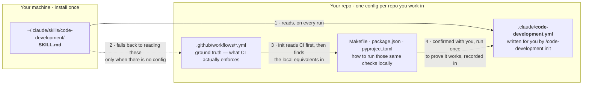
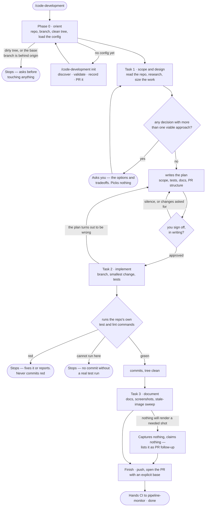

# code-development

Takes a feature, bugfix, or patch from "I want X" to an open pull request, in three tasks
that run strictly in sequence — **scope → implement → document** — so no task steps on
another.

This skill has real side effects: it creates branches, commits, pushes, and opens PRs. It
never touches the default branch directly, and it never commits code whose tests haven't
actually passed.

**General-purpose.** Repo-agnostic — nothing in it is wired to a particular project.
Everything project-specific lives in a `.claude/code-development.yml` committed to the repo
you're working in, and `/code-development init` discovers it, validates it by running it,
and writes it for you.

---

## Before you start

This skill **works inside** an existing repo and ends by opening a PR. It does not create a
project, and it does not write your test harness. You need:

| | Why |
|---|---|
| A git repo with a remote | Every path through this skill ends in `git push` and a PR. No remote → `init` stops and tells you to add one |
| `gh` CLI authenticated, or a connected GitHub MCP server — **with push access** | Branches get pushed and PRs get opened. Read-only auth fails at the last step, after the work is done |
| **A runnable test command** — `make test`, `npm test`, `pytest`, `go test`, whatever your repo has | Hard rule 3 is "no commit until local tests pass." A repo with nothing to run has no gate, and `init` stops there rather than pretending |
| Claude Code | Not a chat skill |
| Playwright, with browsers installed | Only for the Task 3 screenshots. `npx playwright install chromium`, or your repo's equivalent. Repos that record `screenshots.mode: none` never need it |
| CI workflows under `.github/workflows/` | Not required, but strongly wanted — they're the ground truth for what your code has to pass. None → a development run says so and *offers* to add a basic lint + test workflow, under the Task 1 gate. It never adds one silently, and `init` never adds one at all |

If you have no test command yet, that's the one gap to close before running this. Writing
that harness is itself a good `/code-development` task once anything runnable exists — but
`init` won't invent one for you, because a config that claims `npm test` works when it
doesn't is worse than no config at all.

---

## Where the files go

Two different `.claude` things, in two different places. This trips up almost everyone the
first time:



- **The skill** is a folder you copy once. It is the same for every project.
- **The config** is one small YAML file per repo, and it's the only project-specific thing
  that exists. Without it the skill still works — it just re-derives the same facts on every
  run and forgets every answer you gave it.

---

## Install

### Step 1 — copy the skill

```bash
git clone https://github.com/dawg-io/claude-skills.git
cd claude-skills

# personal — available in every project (recommended)
mkdir -p ~/.claude/skills
cp -r code-development ~/.claude/skills/

# or project-scoped — checked in alongside the code it serves
mkdir -p /path/to/your-repo/.claude/skills
cp -r code-development /path/to/your-repo/.claude/skills/
```

Start a new Claude Code session — skills are picked up at session start, not live. Confirm
it loaded by typing `/` and looking for `code-development` in the list.

### Step 2 — set up the repo you'll work in

From inside that repo:

```
/code-development init
```

It reads your repo rather than quizzing you: lists your CI workflows and takes the real
commands out of them, finds the local equivalents in your `Makefile` / `package.json` /
`pyproject.toml`, and asks only the handful of things it genuinely can't read — which of
your three test scripts is *the* one, whether PRs open ready or draft, whether screenshots
apply here at all.

Then the part that matters: **it runs the commands it recorded** before committing
anything. A missing script is a config bug it fixes on the spot; a real test failure is
reported as pre-existing and left alone. Only then does it write
`.claude/code-development.yml`, show it to you in full, commit that one path on a branch,
and open a PR. It merges that PR only if you say yes.

You can write the file by hand instead — see [Configuration](#configuration) — but nothing
by hand gets validated, and an unvalidated config's first failure lands in the middle of an
implementation.

### Step 3 — develop something

```
/code-development
```

In a repo with no config it offers `init` first and says so. Decline and it discovers your
toolchain inline for that run only, exactly as it always did — and tells you nothing is
being recorded.

---

## What a real run looks like



The two diamonds that matter are the **gates**: your written sign-off on the plan, and a
real green test run. Neither can be turned off, and neither accepts an assumption in place
of the thing itself.

From your seat, a clean run asks for your attention three times:

1. **The config echo.** Phase 0 reads your config back at you — the test and lint commands
   that will gate the commit, the branch it'll cut from, whether the PR opens ready or
   draft, and any check CI enforces that nothing local reproduces. Wrong value? Say so now,
   before it matters.
2. **Anything with two viable answers.** Task 1's open questions and design decisions arrive
   together in one message, with the options, the tradeoffs, and a recommendation — not as a
   drip-feed, and never resolved by coin flip.
3. **The plan.** Task 1 posts it and stops. It contains every one of those questions already
   answered, every design decision resolved, the files it expects to touch, the test plan,
   and the PR structure. Read it and say "approved" — **silence is not sign-off** and the
   skill won't take it as such.

Then it branches, implements, runs your tests out loud, commits on green, writes the docs,
captures the screenshots, pushes, opens the PR with an explicit base, and hands CI to
`pipeline-monitor`.

Run Task 1 in **plan mode** (Shift+Tab twice) — the skill reminds you — so nothing gets
edited while the design is still open.

### When it stops on you

| It says | What happened | What you do |
|---|---|---|
| **No remote, or no push access** | Both modes end in `git push` and a PR, and neither can | Add a remote, or authenticate `gh` with write access. It stops here rather than after the code is written |
| **Dirty working tree** | Phase 0 found uncommitted changes, or `init` did | Commit, stash, or discard them. The skill won't sweep stray work into a feature commit — and `init` refuses to start in one at all |
| **The branch you'd cut from is behind origin** | Your local `branch.default` is behind its remote | Pull it, or say to branch anyway. It won't silently build on a stale base |
| **The plan is posted, waiting** | Task 1's gate | Read it and reply "approved", or edit it and then approve. Nothing is written until you do |
| **Two viable approaches** | A design decision with no single right answer | Pick one. It gives you the options and a recommendation, and refuses to choose for you |
| **Tests are red** | Your suite failed on the change | It fixes them or stops. It will never commit red, narrow the test run, or loosen a lint rule to get green |
| **Local tests can't run here** | No runnable test command in this environment | Nothing gets committed. Fix the environment or run `/code-development init` to record a command that works |
| **Recorded command not found** | Your config is stale — a script was renamed or removed | Fix that line in `.claude/code-development.yml`. It names the key and what the repo has instead, and won't substitute a command of its own |
| **The plan was wrong** | Implementation hit something the plan didn't cover | The Task 1 gate reopens. Amend and re-approve — scope never quietly grows |
| **No CI workflows** | Nothing under `.github/workflows/` | A development run offers to add a basic lint + test workflow, then waits. Local checks still run either way. `init` only records the absence |
| **Screenshot can't be captured** | The app won't start and mocks won't render | Nothing is fabricated. The exact captures still needed go in the PR body as follow-up |
| **`init` found no test command** | Setup has no gate to record | Add a runnable test command first. `init` won't write a harness, and it won't record a command it couldn't run |

---

## The two modes

| You type | It does | It writes |
|---|---|---|
| `/code-development init` | Discovers your toolchain from CI first, validates it by running it, writes `.claude/code-development.yml`, opens a PR for it | One file, on a branch, after you've seen it |
| `/code-development` | Phase 0, then Tasks 1–3, then the PR | A branch, commits, a push, a PR |

Plain `/code-development` in a repo with no config offers `init` first and says so. Decline
and it discovers inline for that run and records nothing.

### When it triggers

- `/code-development`, `/code-development init`
- "develop a feature", "fix a bug that…", "can you fix this bug", "implement X"
- Any ask to build, implement, fix, or patch code — including when coding has already started
- "set up code-development", "configure code-development" → init

Not for CI failures (that's `pipeline-monitor`), releases (`code-release`), or reviewing someone
else's PR.

---

## Configuration

The whole project-specific surface is one file, in the repo you're working in:

```yaml
version: 1

branch:
  default: main                   # what feature branches are cut from
  prefixes:
    feature: feature/
    fix: fix/

commands:                         # the local gate — all of these must pass before a commit
  test: "npm test"
  lint: "npm run lint"
  typecheck: "npm run typecheck"  # omit if the repo has none
  format: "npm run format -- --check"
  build: "npm run build"          # omit if a build isn't part of the local gate

ci:
  workflows: [".github/workflows/ci.yml"]
  enforces: ["lint", "test", "typecheck", "codeql"]
  local_gap: "CodeQL runs only in CI — nothing local reproduces it"

pr:
  base: main                      # a stacked PR targets the stage below instead
  ready: true                     # false → open as a draft
  conventional_commits: true
  template: ".github/pull_request_template.md"   # omit if the repo has none

docs:
  paths: ["README.md", "docs/**"]
  images: "docs/images"

screenshots:
  mode: playwright-local          # playwright-local | playwright-mock | none
  start: "npm run dev"            # omit when mode is none
  url: "http://localhost:5173"
  viewport: "1280x800"
```

Required: `version`, `branch.default`, and a `commands` block with at least `test`.
Everything else is optional, and every omission has one defined behavior:

| Omitted | What happens |
|---|---|
| `branch.prefixes` | `feature/` and `fix/` |
| `commands.lint` | No lint step in the Task 2 gate. It says so rather than inventing one |
| `commands.typecheck` / `format` / `build` | Not part of the gate |
| `ci` | Nothing is claimed about what CI enforces, so the CI-vs-local gap goes unstated |
| `pr.base` | Falls back to `branch.default` |
| `pr.ready` | Ready for review, not draft |
| `pr.template` | Uses the skill's own What / Changes / Tests / Docs / Risks template |
| `pr.conventional_commits` | True |
| `docs.paths` | Discovers `docs/`, `README.md`, a wiki dir — whatever the repo has |
| `docs.images` | `docs/images` |
| `screenshots.viewport` | `1280x800` |
| `screenshots` entirely | Treated as `mode: playwright-local`, discovering the app's start command in Task 3 exactly as an unconfigured repo would |

`ci.local_gap` is the field worth filling by hand if you write this yourself. It's how
"SonarQube and CodeQL only ever run in CI" stays visible on every run instead of being
rediscovered, or forgotten and then reported as passing.

---

## How it works

### Setup mode — `/code-development init`

Confirms push access, discovers the repo, refuses to start in a dirty tree, and refuses to
overwrite a config you haven't seen. Then the prerequisite checks that actually save people,
in order: not a git repo, no remote, no write access, and — the one that stops most often —
**no detectable way to run tests**. It says exactly what it looked for, and it does not
write a test harness, a CI workflow, or a placeholder command to get past it.

Otherwise it reads **CI first as ground truth**, taking the concrete step commands out of
the workflow YAML rather than inferring them from the language, then finds the local
equivalents and notes every check CI runs that has no local counterpart.

It asks only what it can't read, offering the derived answer each time so you're correcting
rather than composing. Then it writes the file, shows it in full, and **runs the recorded
commands before committing** — announcing which ones first, since a `test` target can have
side effects. It reads the two failure modes differently, which is the whole value of the
step: a command that doesn't exist means the *config* is wrong and gets fixed on the spot,
while a command that ran and failed means the *repo* is red and gets recorded as
pre-existing. Decline to run them and they're reported as **unvalidated**, never as verified.
Anything it fixes gets shown to you again — you confirmed the version it had, not the one it
changed.

Finally it commits that one path on a branch cut from the default branch (never `git add
-A`, never a push to the default branch), pushes, opens a PR, and merges it only on an
explicit yes. Then it puts you back on the branch you started on.

Setup never edits code, adds a test, adds a workflow, or starts Task 1. It discovers,
validates, records, and stops.

### Phase 0 — Orient

Verifies the ground with real commands before anything else: repo root, current branch,
default branch, whether the tree is dirty. A dirty tree is a stop-and-ask — stray work must
not get swept into a feature commit.

Then it loads `.claude/code-development.yml`, with three outcomes stated aloud so it never
silently degrades: **found** (echoed back so you can catch a wrong value before it matters,
and toolchain rediscovery is skipped entirely — though not trusted blindly: a recorded
command that turns out not to exist is caught in Task 2, where it stops the run),
**absent** (offers `init`; discovers inline if you decline, and says nothing is being
recorded), or **invalid** (stops, naming the key — no silent fallback to defaults for a
required field).

Only then does it check that the branch it'll cut from is current — because `branch.default`
is what feature work branches off, and on a repo that develops off `develop` that isn't the
same as GitHub's default branch. If the two differ it says so here, rather than letting it
surprise you at PR time.

Classifies the request as **feature, bugfix, or patch**. All three run all three tasks; a
bugfix does not get to skip documentation by category.

### Task 1 — Scope and design

Goal: a written plan with zero open questions, signed off by you. Best run in plan mode
(Shift+Tab twice), and the skill says so up front.

1. Restates the request in its own words — what the change is *for*, not just what it says
2. Reads before asking: affected code, related modules, existing tests and docs, recent PRs on the same files
3. Researches anything unfamiliar and cites sources — "best practice says" with no source is a guess wearing a suit
4. Enumerates every open question and every design decision with more than one viable approach, with tradeoffs and a recommendation, asked together in one message
5. Sizes the work. Bigger than one reviewable PR → proposes a **stacked-PR breakdown** with every branch named
6. Writes the plan: scope, out of scope, resolved decisions, files expected to change, test plan, doc/screenshot impact, PR structure

**Gate:** the plan is posted and the skill stops. Task 2 starts only on explicit sign-off.
Silence is not sign-off. If implementation later reveals the plan was wrong, this gate
reopens — the plan is amended and re-approved, not quietly outgrown.

### Task 2 — Implement

1. Branch: `feature/<slug>` or `fix/<slug>` (or your `branch.prefixes`), cut from an up-to-date `branch.default` — or from the previous stage's branch when stacked
2. Implements exactly the plan — the smallest change that fully delivers it
3. Writes to scanner standards even where the scanner can't run locally: bounded inputs, parameterized queries, explicit error paths, no secrets, no duplicated blocks or dead code, released resources, no unapproved dependencies
4. Tests: a bugfix's test must be **verified to fail against the unfixed code**, by actually running it
5. Runs every command in the config's `commands` block — or, with no config, the equivalents discovered in Phase 0. Green → commit. Red → fix or stop. A recorded command that isn't found is a **stale config**: it stops and names the key rather than substituting one of its own
6. Commits: Conventional Commits (unless `pr.conventional_commits` is false), one concern each, files staged **by name** — never `git add -A`

**Gate:** tests green, work committed, tree clean, with the exact commands and their real
output reported.

### Task 3 — Document

1. Finds the docs — `docs.paths`, else `docs/`, `README.md`, a wiki dir. **No docs at all → create or extend `README.md`.** That's the floor
2. Writes what the change does, how to use it, config/flags added, breaking changes. For a bugfix, checks whether existing docs describe the old broken behavior
3. Screenshots whenever the change is user-visible and `screenshots.mode` isn't `none`: Playwright at `screenshots.viewport` (1280×800 by default), saved to `docs.images`, named for the feature. Includes a **stale-image sweep every run, bugfixes included**
4. Commits docs separately as `docs:` commits

If neither a real local run nor a mock will render, it captures nothing and claims
nothing — the needed captures go in the PR body as follow-up. `screenshots.mode: none` is
reported as "this repo has nothing to screenshot", never as a skipped step.

### Finish

Pushes, then opens the PR with an **explicit `--base`** — `pr.base`, or the stage below for
a stacked PR. That explicitness is load-bearing: `gh pr create` without a base targets the
repo's default branch, which silently flattens a stack into one enormous PR.

Ready for review unless `pr.ready` is false or you said otherwise. The body is fully filled
from `pr.template` if your repo has one, else the skill's own fixed template — What /
Changes / Tests / Docs / Risks & follow-up. Then it hands CI off to `pipeline-monitor` and says so.

---

## Hard rules

1. **Never guess on direction.** Any decision with more than one viable approach is a stop-and-ask
2. **Task gates are hard.** No look-ahead, no "while I'm here"
3. **No commit until local tests pass**, run for real — governs commits that change code;
   setup mode's single config commit is the one exemption
4. **Never push directly to the default branch**, or to `branch.default` — `feature/`,
   `fix/`, or `chore/` in setup mode, always via a PR
5. **Smallest change, explicit staging**
6. **Setup mode commits exactly one path**, `.claude/code-development.yml`, and authors
   nothing else — validation runs are never staged
7. **The config is the contract; the repo is the truth** — where they disagree, stop and name the stale key

## What it will never do

- Start Task 2 without sign-off, or Task 3 with red tests
- Commit or push code whose local tests didn't run or didn't pass
- Push directly to the default branch or to `branch.default`, force-push, or `git add -A`
- Weaken any check to get green — skipping tests, loosening lint, lowering coverage,
  `continue-on-error`, scanner exclusions
- Expand scope beyond the signed-off plan without reopening the gate
- Add a dependency, schema change, or workflow edit the plan didn't approve
- Fabricate a screenshot, or present a mock as the real application
- Write code, tests, docs, or a CI workflow while in `init` — setup records, it doesn't build
- Record a command it didn't run, or call an unvalidated command verified
- Substitute a different command when a recorded one is missing, instead of stopping
- Merge the config PR without an explicit yes
- Watch, re-run, or diagnose CI — that's `pipeline-monitor`'s job

## Output

Every task ends with a fixed report block naming the target repo and branch, which config
was used and where it came from, status, what the task produced, the **exact commands run
and their real results**, and open questions. `"not run — <reason>"` is an accepted answer
there. A fabricated pass is explicitly called out in the skill as the one failure mode that
would make it worse than developing by hand — and in setup mode the same rule covers
validation: a command that wasn't run is reported unvalidated, never as working.

The run itself ends with the PR link and the handoff to `pipeline-monitor`.

## Note for editors

The `description` in the frontmatter is **1014 of the 1024 available characters**. Any
addition needs a matching cut.
