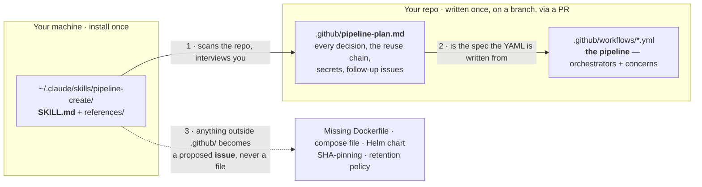
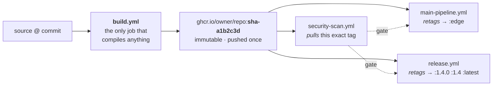

# pipeline-create

Takes a repo with **no CI** and gives it one. Reads the code to find every language and
where it lives, interviews you about artifacts, branching, what runs on each branch, and how
it ships — then writes a set of split-by-concern GitHub Actions workflows on a branch and
offers a PR.

It has real side effects: it creates files, commits, and pushes a branch. It never pushes to
trunk, never merges, and never runs the pipeline it writes.

Two rules shape everything it produces. **Build once** — every stage after the build
consumes the artifact the build published, and promotion between branches is a retag, never
a rebuild. **Never guess** — every command, registry, runner label and secret name in the
output was either read from your repo or answered by you.

**General-purpose.** Repo-agnostic: it detects your languages rather than assuming them, and
asks for anything it cannot read.

It is the front half of a pair. This skill writes the pipeline; [`pipeline-monitor`](../pipeline-monitor/)
watches it afterwards and fixes what goes red.

---

## Before you start

| | Why |
|---|---|
| A repo with **no** `.github/workflows/`, or workflows you're willing to set aside | Greenfield is what it's for. Existing workflows aren't fatal — it asks once whether to reuse or ignore them, and never edits one uninvited |
| A **clean working tree** | This skill commits. Uncommitted work would get swept in, and it won't stash on your behalf |
| A build that actually works locally | It writes down *your* build command. If nobody can say what that is, the pipeline is unwritable and it stops rather than inventing one |
| `git`, and `gh` authenticated or a GitHub MCP server | Phases 0–5 work without `gh`; Phase 6 — branch, push, PR, issues — cannot |
| Claude Code | Not a chat skill. Repo, branch and layout come from the real working directory |

Optional but worth having: **`actionlint`** and **`yamllint`**. Phase 6 runs them if they're
installed. If they aren't, it reports `not run — not installed` rather than claiming a pass.

Already have CI and want it *fixed*, not written? That's [`pipeline-monitor`](../pipeline-monitor/).
Want a feature built? [`code-development`](../code-development/).

---

## Where the files go

Three things in three places. Only two of them are written by this skill, and neither is
inside the skill folder:



- **The skill** is a folder you copy once. Identical for every project.
- **The workflows** are the deliverable, and the only executable thing it writes.
- **The plan** is the record. It's what lets a later session pick the interview back up, and
  what a reviewer reads instead of reverse-engineering seven YAML files.

**`pipeline-create` has no `init` and no `.claude/pipeline-create.yml`**, unlike the other
five skills here. It runs essentially once per repo, so there's no discovery worth caching
for the next run — `.github/pipeline-plan.md` *is* the record, and it ships with the PR.

---

## Install

### Step 1 — copy the skill

```bash
git clone https://github.com/dawg-io/claude-skills.git
cd claude-skills

# personal — available in every project (recommended)
mkdir -p ~/.claude/skills
cp -r pipeline-create ~/.claude/skills/

# or project-scoped — checked in alongside the repo it builds CI for
mkdir -p /path/to/your-repo/.claude/skills
cp -r pipeline-create /path/to/your-repo/.claude/skills/
```

Both `mkdir -p` lines matter. Without the second, `cp -r` into a missing directory
**succeeds** and copies the folder's *contents*, giving you `.claude/skills/SKILL.md` and a
skill that never loads.

Start a new Claude Code session — skills load at session start, not live. Confirm by typing
`/` and looking for `pipeline-create`.

### Step 2 — run it

From inside the repo that needs a pipeline, on a clean tree:

```
/pipeline-create
```

There is no step 3. It scans, tells you what it found, picks the fast or full path, asks its
questions as prefilled sheets, shows you the plan, and only then writes anything.

Want to practise first? [`example/`](example/) is a complete service with tests, a
`Dockerfile` and deliberately no CI. Run the skill against it and compare with
[`example/expected-pipeline/`](example/expected-pipeline/).

---

## How a run flows

Every diamond is a decision you make, not one the skill makes for you. Every `STOPS` is a
place it will refuse to continue rather than fill a gap with a plausible guess.

```mermaid
flowchart TD
    start(["/pipeline-create"]) --> p0["<b>Phase 0 · Scan</b><br/>repo, trunk, tree state,<br/>languages and where each one lives"]
    p0 --> dirty{"Working tree clean?"}
    dirty -->|"no"| sd(["STOPS · commit or stash it yourself.<br/>It will not stash on your behalf"])
    dirty -->|"yes"| flags["Run every red-flag scan:<br/>lockfiles, tests, credentials,<br/>placeholder test scripts, existing CI"]
    flags --> blocking{"Does a finding make the<br/>pipeline unwritable?"}
    blocking -->|"no build command,<br/>no manifest, broken repo"| sb(["STOPS · says what is missing.<br/>It will not write a workflow around a hole"])
    blocking -->|"no — reported with options"| exist{"Existing workflows?"}
    exist -->|"yes"| ask1(["ASKS once · reuse them as input,<br/>or ignore and start clean"])
    exist -->|"no"| path
    ask1 --> path{"<b>Which path?</b>"}
    path -->|"one language, no deploy,<br/>feature → main"| fast["<b>Fast path</b> · one filled-in sheet,<br/>the whole pipeline prefilled.<br/>Most repos. Offered first"]
    path -->|"polyglot, a deploy target,<br/>or 3+ branch classes"| full["<b>Full path</b> · Phases 1–3.<br/>It tells you up front how<br/>long the interview is"]

    full --> p1["<b>Phase 1 · Artifacts</b><br/>what is produced, where it is published.<br/>Required — there is no skip"]
    p1 --> p2["<b>Phase 2 · Branch model and tagging</b><br/>which branches, what each is tagged with,<br/>one immutable tag per build"]
    p2 --> confirm(["CONFIRMS · restates the whole flow.<br/>Contradictory answers are named,<br/>not silently resolved"])
    confirm --> p3["<b>Phase 3 · What runs where</b><br/>one sheet per branch class, every language<br/>at once · build, test, lint, scan, deploy"]
    p3 --> unknown{"Any stage's trigger, input<br/>artifact or output still unknown?"}
    unknown -->|"yes"| su(["STOPS · asks. A stage with an<br/>unknown input is a broken stage"])
    unknown -->|"no"| p4
    fast --> p4["<b>Phase 4 · Plan the files</b><br/>split by concern, wired with workflow_call,<br/>permissions, concurrency, runners"]

    p4 --> p5["<b>Phase 5 · Review</b><br/>graph of what runs when · every file ·<br/>the reuse chain · secrets to create ·<br/>settings you must configure · proposed issues"]
    p5 --> ok{"Happy with it?"}
    ok -->|"edits"| p4
    ok -->|"yes"| p6["<b>Phase 6 · Land it</b><br/>branch off trunk · write the files ·<br/>actionlint and yamllint if installed ·<br/>stage by path · commit · push"]
    p6 --> gh{"gh or MCP available?"}
    gh -->|"no"| sg(["STOPS at the files · hands them over.<br/>It will not pretend to have pushed"])
    gh -->|"yes"| pr["ASKS · open the PR?<br/>then creates the approved issues"]
    pr --> done(["Done · hands off to <b>/pipeline-monitor</b><br/>to watch the first run"])
```



Read the shape rather than the boxes: **nothing is written until Phase 5 has been shown to
you and accepted**, and the only executable output is a branch you review as a PR.

Note what is *not* on that diagram. It never runs your build, tests or deploy. It never
writes a `Dockerfile`, a compose file or a Helm chart — those become proposed issues. It
never sets a secret, edits branch protection, or asks you to paste a credential into chat.

---

## What a real run looks like

A fast-path run against [`example/`](example/) — one Python service, a `Dockerfile`, no CI:

**Phase 0** reports before it asks anything:

```
## Scan — widgetsvc @ main

| Language | Path | Build tool | Manifest | Lockfile | Tests | Existing CI |
|---|---|---|---|---|---|---|
| Python   | .    | hatchling  | pyproject.toml | requirements-dev.txt (pinned) | pytest, 8 tests | none |

Red flags
  · none blocking. requires-python = ">=3.11" is declared, so the version matrix is
    confirmed rather than asked for.
  · checked: lockfile conflicts, committed credentials, placeholder test scripts,
    existing workflows, other CI systems. All clean — each scan actually ran.

Path: FAST — one language, no deployment target, feature → main.
```

**Phase 1–4 collapse into one sheet.** Every field prefilled with a recommendation and its
reason; you send back only the lines you want different, or `ok`:

```
| field           | recommended                    | why                                    |
|-----------------|--------------------------------|----------------------------------------|
| artifact        | container image                | a Dockerfile exists; this is a service |
| registry        | ghcr.io                        | no secret to create — GITHUB_TOKEN     |
| immutable tag   | sha-<short>                    | derivable, so no cross-run plumbing    |
| moving tags     | edge, then <ver>/<maj.min>/latest | humans read these; jobs never pull them |
| version source  | pyproject.toml [project]       | one place to bump                      |
| test matrix     | 3.11, 3.12                     | requires-python plus current stable    |
| security set    | CodeQL + Trivy on the image    | scans the digest that ships            |
| runners         | <blank>                        | REQUIRED — no safe default; self-hosted |
|                 |                                | changes caching, Docker auth, arch      |
| deployment      | none                           | "done" = an image in GHCR              |
```

**Phase 5** shows the graph, the seven files, the reuse chain stated in full, an empty
secrets table (GHCR needs none), the branch protection you have to set up yourself, and
three proposed follow-up issues. Then it stops.

**Phase 6** writes `.github/workflows/*.yml` and `.github/pipeline-plan.md` on
`ci/add-pipeline`, runs `actionlint`, stages those paths by name, commits, pushes, and asks
about the PR.

The full output — all seven files and the plan — is in
[`example/expected-pipeline/`](example/expected-pipeline/).

### The reuse chain, which is the part worth checking



Same digest at every arrow. Nothing after `build.yml` rebuilds, so the image a scanner
cleared is provably the image that ships. If a review shows a stage rebuilding from source,
that is a bug in the plan — say so before Phase 6.

### When it stops on you

| It says | What happened | What you do |
|---|---|---|
| **Working tree is dirty** | This skill commits; your uncommitted work would be swept in | Commit or stash it. It won't stash on your behalf |
| **No build command exists** | The manifest is there but nothing says how to build it | Tell it the command, or fix the repo. It won't reconstruct one from what the ecosystem usually does |
| **No manifest for this language** | Nothing to detect a build from | Add one, or agree to drop that language from the pipeline |
| **The repo already has workflows** | Not greenfield | Say reuse or ignore. It never edits or deletes an existing workflow uninvited |
| **Two answers contradict each other** | e.g. two branches both claim to be where releases come from | It names both answers and asks which wins |
| **A stage's input is unknown** | Phase 3 ended with a gap | Answer it. A stage with an unknown input artifact is a broken stage |
| **This needs a file you don't have** | A container image with no `Dockerfile`, a Helm deploy with no chart | It proposes an issue. It will not write the file — that's `/code-development`'s job |
| **A credential is committed** | A live secret found in tracked files | Rotate it. The skill names the file and never quotes the value |
| **A deploy job would fire on this branch** | Pushing `ci/add-pipeline` would trigger a deploy | Fix the triggers before pushing. That's a bug in the plan, not a risk to accept |
| **`gh` is unavailable** | No CLI, no MCP server | Phases 0–5 still ran. Take the files and land them yourself — it won't claim a push it didn't make |
| **`actionlint`: not run — not installed** | The linter isn't on your machine | Install it and re-lint, or accept unvalidated YAML knowingly. It will not install tools, and will not report a pass it didn't get |

---

## The two paths

Not modes — the skill picks one in Phase 0 and tells you which:

| Path | When | What you do |
|---|---|---|
| **Fast** | One language, no deployment target, `feature → main`. Most repos | Read one prefilled sheet, send back the lines you want different, or `ok` |
| **Full** | More than one language, a deployment target, or more than two branch classes | Work through Phases 1–3. It warns you up front how many rounds that is, and offers the plan file so answers survive a lost session |

Every phase asks in **sheets, not one question at a time**: a table with every field
prefilled and its reason given. A prefill is a recommendation, never a decision. A field with
no safe default is left blank and marked **required** — `runners` is the one that catches
people, because `ubuntu-latest` is a guess, not a default.

### When it triggers

- `/pipeline-create`, or "pipeline create"
- "set up CI/CD", "add a build pipeline", "write GitHub Actions for this repo"
- "set up builds / tests / scanning / deploys from scratch" — even without saying "Actions"

Not for a red check ([`pipeline-monitor`](../pipeline-monitor/)), a feature or bugfix
([`code-development`](../code-development/)), or cutting a release ([`code-release`](../code-release/)).
Its description also points at `/ai-pipeline` for converting workflows to dispatch-only AI
orchestration — **that skill isn't in this repo**, so treat that line as a boundary marker
rather than a link.

---

## What it writes

One file per concern, wired together by thin orchestrators that carry the triggers:

```
.github/
  pipeline-plan.md       every decision, the graph, secrets, settings, proposed issues

  workflows/
    # orchestrators — these have triggers
    pr-validation.yml    pull_request into the integration branch
    main-pipeline.yml    push to the integration branch
    release.yml          push: tags, or push to release/*

    # concerns — workflow_call only, no triggers of their own
    build.yml            builds and publishes the artifact; returns its reference
    test.yml             unit and integration tests
    lint.yml
    code-quality.yml     Sonar, coverage gates
    security-scan.yml    CodeQL, dependency, container, secret scanning
    sbom.yml
    performance.yml
    deploy.yml           takes an artifact reference as input
```

You get the subset your answers called for — the `example/` run produces seven files, not
all eleven.

**Why `workflow_call` instead of a trigger on each file.** If every concern file triggered
on `push` independently, each would check out and rebuild its own copy of the source. That's
slower, and worse, the artifact the scanner looked at would not be the artifact the deploy
shipped. One orchestrator builds once and passes the reference down.

Every workflow it writes gets: an explicit least-privilege `permissions:` block at workflow
level with per-job grants on top, a `concurrency:` group (cancelling superseded PR runs,
never cancelling a run on an integration branch or a tag), actions pinned by major tag, and
comments explaining anything non-obvious. Plus a **summary job** that reads every result and
fails on an unexplained skip — because a *skipped* job reports success to a required status
check, and without it a whole validation stage can quietly stop running while PRs stay green.

---

## How it works

### Phase 0 — Scan, report, and pick a path

Repo root, current branch, tree state, default branch and visibility, all from real commands
— never assumed. Then detection **from files that exist, not extension counts**: a repo with
400 `.js` files and no `package.json` is a static site, not a Node project. It records the
*directory* each manifest was found in, because that drives `paths:` filters,
`working-directory:`, and whether one workflow or several make sense.

It runs every red-flag scan in `references/detect.md`, not just the manifest one — the
Dockerfile, lockfile-conflict, credential and placeholder-test scans each catch something no
other command does. **A category whose command didn't run is reported "not checked", never
"clean."** Existing tags and remote branches get read here too: they're the cheapest evidence
of the branch model the team already uses, and they become the Phase 2 prefill.

A finding stops the run only when it makes the pipeline **unwritable**. Everything else is
reported with options and the interview continues.

### Phase 1 — Artifacts

What the pipeline produces, and where it's published. Required — without an artifact there's
nothing to test, scan or ship, so there's no skip answer.

The publishing location matters more than the tag scheme here (tagging needs the branch
model, so it waits for Phase 2): the whole reuse chain depends on a downstream job being able
to fetch what the upstream job produced. Multi-artifact repos get one extra question — built
and released together, or independently — because that decides one matrix build versus one
workflow each.

### Phase 2 — Branch model and tagging

It offers the models by name — trunk-based, GitHub flow, git-flow, plus nightly and hotfix as
independent add-ons — rather than making you describe one from scratch, then confirms each
branch individually. Teams routinely say "git-flow" and mean something else.

Then tagging per branch class. **Two tags per artifact, not one**: a moving tag for humans,
and a resolvable immutable one (`sha-<short>`, `pr-<n>`) that downstream jobs pull. The
immutable tag isn't optional — without a name that resolves to exactly one build, a
downstream stage has no choice but to rebuild.

It restates the whole flow and gets an explicit yes before leaving. Phase 3 is built entirely
on this, and a wrong branch model produces a pipeline that never fires.

### Phase 3 — What runs where, and how it deploys

Walked in order, earliest branch to production. **One sheet per branch class covering every
language at once** — three branch classes and two languages is three sheets, never six. Each
sheet covers push to the branch, a PR opened into the next one, and the merge.

The scanning catalog is offered explicitly rather than waiting to be asked: CodeQL,
SonarQube, dependency review, secret scanning, container scanning, SBOM, license checks,
performance thresholds. Leaving security scanning out is your call — but it has to be a call
you made, not one you never saw.

**Reuse is decided here.** For every stage after the first build it states where the input
comes from. A stage that would rebuild from source needs a stated reason, or gets
restructured to pull.

Then deployment, and the follow-ups that target actually needs — Kubernetes means push or
pull, Helm or Kustomize, Flux or Argo; serverless means which cloud and which auth. It won't
leave this phase while any stage's trigger, input or output is unknown.

### Phase 4 — Plan the files

The file layout and the wiring, written down before any YAML exists. Split by concern,
`workflow_call` for the wiring, parallelise what's genuinely independent and chain what
isn't — grouped by the resource each chain contends for rather than interleaved.

**Runners are asked about, never defaulted.** Self-hosted changes caching, Docker credential
handling and possibly architecture: the shared `~/.docker/config.json` on a persistent runner
is wiped when any concurrent job finishes, giving the others a 401 mid-pull, so a per-job
`DOCKER_CONFIG` under `$RUNNER_TEMP` is needed. That's the kind of thing a guessed
`ubuntu-latest` hides until it bites.

### Phase 5 — Review

It presents and stops. A mermaid graph of what runs when per branch class, every file with
its trigger and purpose, the reuse chain stated explicitly, a table of secrets you must
create (**name, purpose, and how — never a value, and it never asks for one**), the
permissions and repo settings it can't set from a file, and the proposed follow-up issues.

Substantial edits get a revised graph rather than an assumption that they landed.

### Phase 6 — Land it

Branch off trunk (`ci/add-pipeline`), write the files, run `actionlint` and `yamllint` if
they're installed and **report the real result**, stage the paths by name — never
`git add -A` — commit, push, ask about the PR, then create the approved issues.

One last check before the push: pushing this branch fires any workflow whose triggers match
it. Nothing it writes should deploy from a topic branch, so if a deploy job would fire here,
that's a bug in the plan and gets fixed first. Watching the resulting run is
[`pipeline-monitor`](../pipeline-monitor/)'s job — it hands over and stops.

---

## Bundled references

Loaded on demand, so a Python repo never reads the Java file. All of them are **snapshots**:
where a reference and your repo disagree, the repo wins and the drift is reported.

| File | What it carries |
|---|---|
| `references/detect.md` | Manifest→language table, the four common layouts, every scan command, the red-flag table with options for each |
| `references/gitflow.md` | The named branch models, the trigger matrix per branch class, tagging schemes, and the five contradictions to check for before leaving Phase 2 |
| `references/patterns.md` | File layout, `workflow_call` wiring, artifact reuse and promotion, passing values between workflows, permissions, concurrency, parallelism, the summary job, self-hosted runners |
| `references/scanning.md` | The catalog — static analysis, supply chain, secrets, runtime and performance testing — with what each needs and where results go |
| `references/languages/` | `python` `node` `java` `go` `dotnet` `rust`, plus `generic` for everything else. Each names what a *healthy* repo in that ecosystem has, the real commands, setup and caching, the version matrix question, artifacts and the tagging convention that ecosystem enforces |
| `references/deploy/` | `registry` `kubernetes` `compose` `packages` `serverless`, plus `generic`. Each has the questions that target actually needs answered |

`generic.md` in both directories is doing real work, not filling a gap: it exists to say the
language or target has **no** convention to fall back on, so every command comes from the
interview. That has to be said out loud in the report rather than quietly papered over.

---

## The bundled example

[`example/`](example/) is a complete Python service — tests, ruff config, a two-stage
`Dockerfile`, **and no `.github/workflows/`**. It's a practice target: run
`/pipeline-create` against a copy and compare.

[`example/expected-pipeline/`](example/expected-pipeline/) is what a fast-path run produces
for it: seven workflow files and the plan, with the reuse chain, the required-check trap and
the fork-PR hole all explained. `actionlint` 1.7.7 passes clean on all seven; they have not
been executed on GitHub Actions, and the README there says so.

`example/README.md` also lists six one-line changes that each make the repo unhealthy in a
specific way — delete the lockfile, add a competing one, remove the tests, commit a
credential — so you can watch each red flag fire.

---

## Hard rules

1. **Never guess.** Every value in a workflow was read from the repo or answered by you. A
   guessed build command, registry or runner label is a broken pipeline that looks finished
2. **Reuse artifacts; never rebuild the same source twice.** Build once, publish once,
   everything downstream consumes it. Promotion is a retag
3. **Security and reliability beat speed.** Parallelise where it's free, never at the cost of
   a gate, a scan, or a deterministic result
4. **Write only under `.github/`.** A missing `Dockerfile`, compose file, chart or manifest is
   a proposed issue, not a file this skill invents
5. **Never claim something ran that didn't.** `"actionlint: not installed — not run"` is a
   correct answer; a fabricated validation pass is the one failure mode that makes this worse
   than writing the YAML by hand

## What it will never do

- Push to trunk, force-push, merge, tag, or dispatch a workflow
- Run your build, tests, scanners, or any deploy command — it doesn't execute what it writes
- Write any file outside `.github/` — no `Dockerfile`, compose file, Helm chart, k8s manifest,
  tool config, or source change
- Edit or delete an existing workflow that wasn't explicitly handed over
- Create a secret, edit branch protection or repo settings, or ask you to paste a credential
  into the chat
- Write a secret, token, key or connection string into any file it creates, including
  comments and examples
- Invent a build command, registry, runner label, image name, secret name, or environment
- Write a workflow that ships an artifact nothing scanned, or that rebuilds on promotion
- Add `continue-on-error`, a blanket retry, or a soft-fail to a gate so the first run goes
  green — a gate that would fail is a finding for the review
- Build a pipeline for more than one repo in a run
- Watch the runs afterwards — that's `pipeline-monitor`

## Output

Every run ends with a fixed report block: the path taken and languages found, the confirmed
branch model, a table of workflows with their triggers, the artifact reuse chain, the secrets
and variables **you** must create, the permissions and settings that can't be set from a
file, the **exact validation commands and their real results**, the branch and whether it was
pushed, the PR, the issues created, and anything noticed but not handled.

`"not run — <reason>"` is an accepted answer in the validation line. A result that didn't
come from a command that actually ran is not.

## Note for editors

The `description` in the frontmatter is **1015 of the 1024 available characters**. Any
addition needs a matching cut.

It names `/ai-pipeline` as out of scope, which is a skill that doesn't exist in this repo —
either add it or drop the clause if that stays true.

Unlike the other five skills here, this one has **no `init` mode and no
`.claude/pipeline-create.yml`**. If that ever changes, the root README needs updating in
three places: the "Five of the six need a second step after copying" line, the
`pipeline-create` bullet under "Three are worth calling out", and the "Each skill except
`pipeline-create` writes one `.claude/<skill>.yml`" convention.
