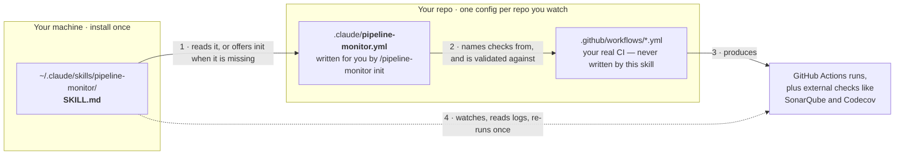
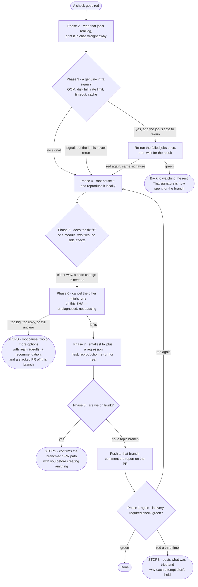

# pipeline-monitor

Watches the CI pipeline for the repo and commit you're working on — after a push, an opened
or merged PR, a tag, or any other gitops action that kicks off a run — figures out why a
check failed, fixes the actual cause, and reports back.

It fires on its own the moment a push happens in a session, including a push it just made
itself. Finishing a push is not finishing the task.

This skill has real side effects: it re-runs jobs, cancels runs, commits, pushes, and
comments on PRs.

**General-purpose.** Repo-agnostic — it reads whatever CI the repo actually has. What it
learns about your repo lives in a `.claude/pipeline-monitor.yml` committed to that repo, written
for you by `/pipeline-monitor init`. The skill itself hardcodes no repo, workflow, or check name.

---

## Before you start

This skill **watches** your CI. It does not write it. You need:

| | Why |
|---|---|
| At least one CI check that runs on push or PR | It's the thing being watched. With no workflows and no external checks, `/pipeline-monitor init` stops and tells you so |
| `gh` CLI authenticated, or a connected GitHub MCP server | Runs, logs, checks, and PR comments all come from there. Read access is enough to diagnose; **write access** is needed to re-run a job, cancel a run, push a fix, comment on the PR, or run `init` |
| `git` | Repo, branch, SHA, clean-tree check, and the fix commit are all local git |
| Claude Code | Not a chat skill — repo and branch come from the actual working directory and checked-out branch |

If the repo has no CI at all, add a workflow first. That's `/code-development`'s job, not
this skill's — it offers to add a basic one as part of setting a project up. `init` will
show you the shape it's looking for and stop:

```yaml
on:
  push:
    branches: [ <your trunk — do not assume it is main> ]
  pull_request:
```

If neither `gh` nor MCP is authenticated, the skill stops and says so rather than inferring
pipeline state from what the code "should" do.

---

## Where the files go

Three different things in three different places, and only one of them is written by this
skill:



- **The skill** is a folder you copy once. It is the same for every project.
- **The config** is one small YAML file per repo you watch. It's the only project-specific
  thing that exists, and `init` writes it from what your repo actually has.
- **The workflows** are yours. This skill reads them, never writes them.

Without the config the skill still works — it derives all of that from the repo on every
single wake. That's slower, and it's slowest exactly when a pipeline is red and you're
waiting.

---

## Install

### Step 1 — copy the skill

```bash
git clone https://github.com/dawg-io/claude-skills.git
cd claude-skills

# personal — available in every project (recommended)
mkdir -p ~/.claude/skills
cp -r pipeline-monitor ~/.claude/skills/

# or project-scoped — checked in alongside the repo it watches
mkdir -p /path/to/your-repo/.claude/skills
cp -r pipeline-monitor /path/to/your-repo/.claude/skills/
```

Start a new Claude Code session — skills are picked up at session start, not live. Confirm
it loaded by typing `/` and looking for `pipeline-monitor` in the list.

### Step 2 — set up the repo you want to watch

From inside that repo:

```
/pipeline-monitor init
```

It reads your repo rather than quizzing you: takes the check names from a real PR (not from
job keys — a matrix job called `build` shows up as `build (20, ubuntu-latest)`, and that's
the name that has to match), maps each one back to its workflow, reads branch protection to
find out which checks actually block a merge, measures typical durations from your last ten
successful runs, and derives a local reproduction command from each job's own `run:` steps.

Then it asks the handful of things it genuinely can't read — which jobs are unsafe to
re-run, whether you want findings on the PR or in chat — writes `.claude/pipeline-monitor.yml`,
shows it to you in full, **validates it against reality**, commits that one path on a
branch, and opens a PR. It merges that PR only if you say yes.

That validation is the part that matters: every check name has to have actually appeared on
a run, every workflow name has to resolve, and every local command has to exist on your
machine. A config that names a check which doesn't exist is worse than no config — it makes
the skill wait forever for something that will never show up.

That's the whole install. There is no step 3: the skill fires on its own at your next push.
You can also ask it anything about CI, or type `/pipeline-monitor`, and it picks up whatever is
happening on the current commit.

---

## What happens when a check goes red



The three `STOPS` are the point of the skill. A diagnosed failure handed back with a root
cause and two real options beats a sprawling fix made under pressure — escalating is a
**successful outcome**, not a failure.

Note what isn't on that diagram: skipping the check, marking it advisory, padding a timeout,
or re-running until it goes green. None of those are paths this skill has.

### When it stops on you

| It says | What happened | What you do |
|---|---|---|
| **This repo has no CI** | No workflows, no external checks — nothing to watch | Add a workflow. `/code-development` offers to; this skill never will |
| **Not authenticated for this repo** | No `gh` and no GitHub MCP server | Authenticate. It won't guess pipeline state from reading your code |
| **Read access only** | It can diagnose but not push the fix | Grant write access, or take the diagnosis and push it yourself |
| **Working tree is dirty** | Uncommitted work would get swept into a CI-fix commit | Commit or stash it yourself. The skill won't stash on your behalf |
| **You're behind the remote** | The diagnosis would be built on a stale tree | `git pull`, then re-run |
| **No open PR for this branch** | Nowhere to post the report, nobody reviewing the branch | Open one, or tell it to go ahead anyway. Diagnosing is fine either way — it's the pushing that needs the go-ahead |
| **This job is marked never-rerun** | An infra signal on a job that deploys or publishes | Decide yourself whether re-running is safe. It won't re-run a job with side effects |
| **Too big to fix here** | A Phase 5 escalation condition hit | Pick one of the options it laid out. It recommends one and says why |
| **The failing check is on trunk** | Fixes never land on trunk directly | Confirm the topic-branch-and-PR path, and it creates it |
| **A secret appeared in the logs** | A workflow step leaked a credential | Rotate it. The skill names the workflow and step, and never quotes the value |
| **Three failures on this branch** | Three fix attempts, still red | Take it over. It stops looping and posts what it tried and why each attempt didn't hold |
| **A config already exists** (init) | `init` won't overwrite something you haven't seen | Look at what it shows you, then say update or keep |
| **Branch protection is unreadable** (init) | Those endpoints need admin | Tell it which checks block a merge. It won't assume all of them, or none |
| **Validation failed** (init) | A recorded check name, workflow, or local command doesn't exist | Correct it. It won't commit a config it couldn't verify |

---

## The two modes

| You type | It does | It writes |
|---|---|---|
| `/pipeline-monitor init` | Inventories the repo's real CI, writes `.claude/pipeline-monitor.yml`, opens a PR for it | One file, on a branch, after you've seen it |
| `/pipeline-monitor`, or nothing at all | The full run, Phases 0–9 | One job re-run, run cancellations, a fix commit on the topic branch, PR comments |

**Setup never diagnoses or fixes. A run never writes the config.**

Inside a run, Phase 0 picks a *run mode* from the state of the checks — **watch** (still
running), **post-hoc** (all concluded, at least one failed), or **nothing to do**. That's a
separate axis; all three live inside the run.

A run with no config doesn't silently interview you. If checks are in flight, watching wins
— it derives everything from the repo and offers `init` at the end. Only when nothing is
running does it route into setup.

### When it triggers

- Automatically, the moment a push, PR, or merge happens in the session — **including a push
  it just made itself**
- `/pipeline-monitor`, `/devops`, `/pr-pipeline-watch`
- `/pipeline-monitor init`, "set up pipeline-monitor", "configure CI watching" → setup
- Any question about CI, a build, or a red check — down to a bare "did that pass?"

Not for feature work (`code-development`) or releases (`code-release`).

---

## Configuration

The whole of the project-specific surface is one file, in the repo being watched:

```yaml
version: 1

local:
  setup: "npm ci"                        # optional — run once before any `local` below

checks:
  - name: "build (20, ubuntu-latest)"    # the check name exactly as it appears on a PR
    workflow: "CI"                       # workflow display name, or `external`
    on: [push, pull_request]             # when this check is expected to appear
    gate: required                       # required | advisory
    local: "npm run build"               # how to reproduce it here, or null
    rerun: safe                          # safe | never
    typical_minutes: 4

  - name: "SonarQube Code Analysis"
    workflow: external
    on: [pull_request]
    gate: required
    local: null
    rerun: never
    details: "https://sonarcloud.io/dashboard?id=acme_app"

merge_queue: false                       # true → checks run on a queue ref, not your head SHA

report:
  pr_comment: true                       # false → report in chat only
  comment_on_flake: true                 # false → stay quiet when a re-run clears a blip
```

Only `version` and a non-empty `checks` are required, and within a check only `name`, `gate`
and `rerun`. Everything else defaults as shown.

| Field | What it changes |
|---|---|
| `gate: required` | Must be green before the PR is done. A failure here gets diagnosed and fixed |
| `gate: advisory` | Reported, never chased, never blocking. A red advisory check is a finding, not a task |
| `rerun: safe` | Eligible for the single Phase 3 re-run, and only on a confirmed infra signal |
| `rerun: never` | Never re-run, even on a clean infra signal — the job deploys, publishes, or writes somewhere shared |
| `local` | The Phase 4 reproduction command. `null` means it can't be reproduced here, and the skill says so instead of inventing one |
| `on` | The checks to *expect* on a commit, so a required check that silently stops appearing is a finding rather than silence |
| `typical_minutes` | How long a check may take before "still queued" becomes "something is wrong" |
| `merge_queue: true` | After a merge, checks run on the queue's ref, not your head SHA — so it follows those instead of concluding the checks vanished |
| `report.*` | Where the report goes, and whether a cleared infra flake is worth a comment |

**Deliberately not recorded:** the repo name, the trunk branch, and the current PR number.
All three are one cheap command away and all three go stale.

**The config is the contract; the repo is the truth.** Where they disagree — a check
renamed, a workflow deleted, protection changed — the skill names the stale key, reports
what the repo actually has, and keeps working from the repo. It never edits the config to
make the disagreement go away, and it never edits it mid-run to change how that run ends.
Flipping a check to `advisory` to get green is the same cheap fix as flipping it in CI.

---

## How it works

The unit of work is the **commit**, not "the latest run" — a single push commonly triggers
several workflows plus external checks that aren't GitHub Actions at all.

### Setup mode — `/pipeline-monitor init`

Confirms write access, discovers the repo, refuses to start on a dirty tree, and refuses to
overwrite a config you haven't seen. Then the check that actually saves people: it looks for
workflows, workflow triggers, and external check-runs on recent commits. **Nothing at all →
it stops**, shows the trigger shape it was looking for, and points at `/code-development`
rather than writing CI itself. Two near-misses get named separately rather than lumped in:
workflows that only run on a schedule or a dispatch (nothing will fire on your push), and a
repo with no workflows but real external checks (a perfectly good config).

Otherwise it derives: check names from a real PR, workflows from `gh workflow view`, `gate`
from branch protection or rulesets, `typical_minutes` from your last ten successful runs,
and local reproduction commands from each job's own `run:` steps — each one checked against
your machine before it's offered, because a workflow step often runs in a container or a
`working-directory` and isn't directly runnable here.

It asks only what it can't read: which jobs are unsafe to re-run, and where you want
findings posted. Then it writes the file, shows it in full, validates every name and command
against reality, commits that one path on a branch cut from trunk (never `git add -A`, never
a push to trunk), pushes, opens a PR, and merges it only on an explicit yes — the one PR
this skill may ever merge. Then it puts you back on the branch you started on.

### Phase 0 — Orient, load config, pick a run mode

Repo, branch, commit, the config, clean tree, local-vs-remote sync, and branch class (topic
vs trunk) — all verified with real commands. Notes the open PR number. Reads **what the
change is actually for**, which is the whole advantage of running here rather than in a
detached auto-fix workflow: a fix has to be consistent with the PR's intent, not merely
produce a green checkmark.

The config has three outcomes, each said aloud so it never silently degrades: found (echoed
back so you can catch a wrong value), absent (watch first, offer `init` after), or
unparseable (named by key, then it carries on deriving from the repo — a broken config is
not a reason to leave a red pipeline undiagnosed).

Then it picks a run mode: **watch**, **post-hoc**, or **nothing to do**. Arriving straight
from its own push, it skips the re-derivation and goes to Phase 1 without asking permission
— watching is the default.

### Phase 1 — Attach to every check on this commit

Lists Actions runs for the exact SHA (expect more than one) *and* every external check —
SonarQube, Codecov and friends report as commit statuses with no Actions run behind them.
Then it compares what showed up against what the config says to expect: a required check
that is nowhere on the commit is a **finding**, not a pass. In watch mode it follows to
completion rather than sampling once, reporting transitions as they happen, and uses
`typical_minutes` to say whether a slow check is slow-as-usual or stuck.

The moment any job fails it goes straight to Phase 2; the rest keep running. A failing
**advisory** check is read and reported but never starts a fix.

### Phase 2 — Read the actual failing log

The check name tells you *what* failed; only the log tells you *why*. Narrows to the failing
job by numeric `databaseId`, works backwards from the tail on truncated output, follows the
config's `details:` URL (or the check's `details_url`/annotations) for non-Actions checks,
and separates the first real error from its downstream noise. Prints a plain-English readout
**in chat immediately** — not held until the fix is ready.

### Phase 3 — Classify: infra blip or real failure

Infrastructure signals are enumerated explicitly: disk exhaustion, OOM/exit 137, external
service timeouts, rate limiting, cache service errors, runner allocation problems. If and
only if one is present — **and the job isn't marked `rerun: never`** — it re-runs the failed
jobs only, once, and waits for the result. Everything else — a failing assertion, type
error, missing dependency, bad config, quality-gate violation — skips the re-run entirely.

The re-run budget is one per run ID, and **never a second for the same failure signature
anywhere on the branch**, however many new run IDs a push creates. "Flake" is not a root
cause.

### Phase 4 — Root-cause it, and reproduce it

"Test X failed" is not a root cause. It reproduces locally using the config's `local.setup`
and that check's `local:` command, rather than reconstructing something from workflow YAML.
If the command is `null` or the reproduction fails for any other reason, it says so
explicitly and carries that caveat into the report — it never invents a command to fill the
gap. Checks whether the failure is even in code this branch touched.

### Phase 5 — Size the fix: targeted, or escalate

**Escalates and stops** when the fix touches more than one module or two source files; when
it's small but could plausibly have side effects elsewhere; when it needs a schema,
migration, or dependency change; when the failure is pre-existing or upstream; when the root
cause still isn't clear-cut; or when the correct fix and the fast fix disagree.

Escalating is a **successful outcome**, and it means offering options — two or more concrete
approaches with real tradeoffs, a recommendation, and a **stacked PR** cut from the current
branch and targeting it, so the feature under review stays reviewable on its own.
Recommended, not created.

Posts the formal diagnosis before writing any code, whichever way the sizing went.

### Phase 6 — Clear the rest of the run (watch mode only)

Once a code fix is known to be needed — whether it's making it or it escalated — cancels the
other in-flight runs on that SHA, which are about to be superseded anyway. Lets
nearly-finished checks conclude first, and records every cancelled run as *undiagnosed, not
passing*. This is not the same as disabling a check; nothing's configuration changes. In
post-hoc mode there's nothing in flight, so it's a no-op that still reports "none".

### Phase 7 — Fix and test honestly

Fix scoped to Phase 5, a regression test that would have caught this specific failure,
re-run the reproduction, report the actual result. The config's `local:` entries are the
list of commands to run.

### Phase 8 — Land it

Commit message describes the root cause and the fix, not "fix CI", staging changed files by
name. Topic branch → push there. Trunk → never directly; stop, confirm the
topic-branch-and-PR path, then create it. Then re-read HEAD and return to Phase 1 for the
run the fix triggered — the job isn't done when the fix is pushed, it's done when **every
check marked `required`** is green, or it's escalated. With `merge_queue: true`, the checks
that matter after a merge run on the queue's ref, and it follows those too.

A second failure of the same check means the first diagnosis was wrong: back to Phase 4 with
fresh eyes, not another fix along the same trajectory. Three failures across attempts on one
branch → stop looping and hand it over.

### Phase 9 — Report

Five fixed templates — Diagnosis, Fix applied, Infra flake, Escalation, and Setup — posted
as a PR comment when there's a PR and `report.pr_comment` isn't false, in chat otherwise.
One block per root cause, each carrying a `Config:` footer line saying whether the run was
working from a loaded config or deriving from the repo.

---

## Hard rules

1. **Root cause, not symptom**
2. **No cheap fixes.** Green pipeline with the bug still there is a failure of the skill,
   not a success
3. **No unrelated changes**
4. **Never push to trunk**
5. **Never claim a command ran that didn't**
6. **Never guess** — not at a root cause, a job id, what a log said, or what a check
   enforces
7. **Setup commits exactly one file; a run commits only the fix.** `.claude/pipeline-monitor.yml`
   is written by `/pipeline-monitor init` alone, on a branch, after you've seen it — and never
   edited during a run to change how that run ends. `git add -A` is never correct in either
   mode

## Secrets handling

CI logs routinely contain tokens and connection strings, and this skill pastes findings into
PR comments that may be public. It never quotes a credential-shaped value, never writes one
into a file it creates (the config included), and never prints `.env` or `*.tfvars`
contents. A secret appearing in log output is treated as a **finding**: named at the top of
the report, with the leaking workflow and step identified and rotation recommended — not
quietly redacted.

## What it will never do

- `git push --force` to a shared branch, or any push to trunk
- Write, generate, or repair CI workflows — a repo with no CI is handed to
  `/code-development`
- Dispatch, enable, or disable workflows; create releases or tags; edit branch protection
- Merge or close any PR except the `.claude/pipeline-monitor.yml` config PR that `init` opened,
  and that one only on an explicit yes. It never merges the PR under review
- Commit anything but the fix and its regression test in a run, or anything but the config
  in setup — and never `git add -A`
- Change a repository or environment secret
- Skip, disable, or loosen a failing test, assertion, lint rule, or quality gate
- Lower a coverage threshold, add a scanner exclusion, or mark a finding won't-fix
- Edit `.claude/pipeline-monitor.yml` mid-run to change how the run ends — downgrading a check in
  the config is the same cheap fix as downgrading it in CI
- Pad timeouts, add blanket retries, or add `continue-on-error` to hide a real failure
- Hardcode an expected value, mock around the bug, or swallow an exception
- Pin a dependency to dodge a break without understanding it
- Edit `.github/workflows/*.yml` beyond a genuine infra fix — never to make a check optional
  or non-blocking
- Re-run a job marked `rerun: never`, or repeatedly re-run anything hoping for green

## Output

One block per root cause, in a fixed shape: the failing check and whether it was required or
advisory, the run link, the exact failing step, the root cause in plain terms, the files
changed and why, the runs cancelled in Phase 6 (undiagnosed, not passing), whether it was
reproduced locally and how, the exact test commands and their **real** results, and
risks/follow-up. `"not run — <reason>"` is an accepted answer; a fabricated pass is the one
failure mode that makes this skill worse than reading the logs by hand.

Setup ends with its own block instead: what CI was found, what was recorded, what validated,
the config PR link, which branch you're on, and whether there's anything to watch right now.

## Note for editors

The `description` in the frontmatter is **1014 of the 1024 available characters**. Any
future edit to it must remove at least as much as it adds.

`init` is named in it, and has to be. The description is the only text a skill loader
matches, so a trigger documented here but missing there simply never fires — and this README
advertises `"set up pipeline-monitor"` as a natural-language trigger. Room was made by tightening
the prose, not by dropping any trigger: the automatic post-push firing, the slash commands
and the bare `"did that pass?"` are all still in there.
