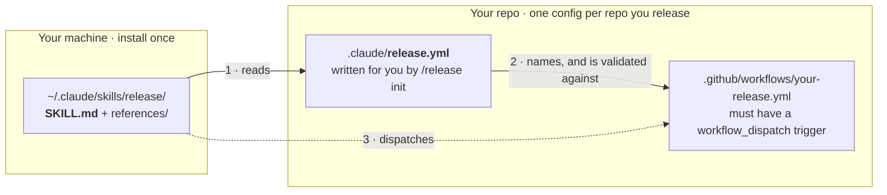
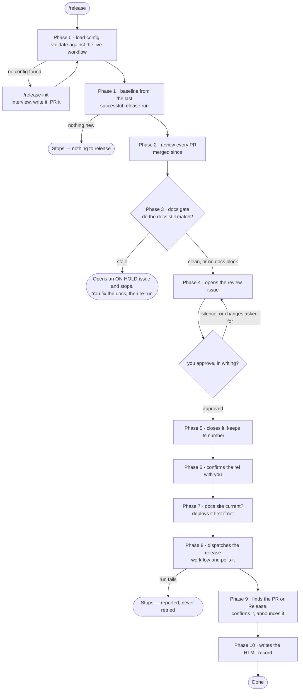

# release

Runs a repository's release process end to end: audit what changed and whether docs and
screenshots still match it, get human approval on a review issue, make sure the live docs
site is current, dispatch the release workflow with that issue's number, track it, announce
the outcome, and leave behind an HTML record of what shipped.

**General-purpose.** Everything project-specific comes from a `.claude/release.yml`
committed to the repo being released — the skill itself hardcodes no repo, workflow, branch,
or input name. `/release init` writes that file for you.

This has real side effects: it opens and closes GitHub issues, dispatches a production CI
workflow, and posts an announcement. `/release dry-run` rehearses the whole thing without
touching anything.

---

## Before you start

This skill **dispatches** your release workflow. It does not write one. You need:

| | Why |
|---|---|
| A GitHub Actions workflow with a `workflow_dispatch:` trigger | It's the thing being triggered. Without it there is nothing to release with, and `/release init` stops and tells you so |
| `gh` CLI authenticated, or a connected GitHub MCP server — **with write access** | Issues get created and workflows get dispatched. Unauthenticated web fetches are not a fallback |
| Claude Code | Not a chat skill |
| Slack tooling | Only if you want the announcement step |

If your release workflow has no `workflow_dispatch:` trigger, add one before going further —
that's `/code-development`'s job, not this skill's:

```yaml
on:
  workflow_dispatch:
    inputs:
      version:
        description: Ref or version to release
        required: true
```

---

## Where the files go

Two different `.claude` things, in two different places. This trips up almost everyone the
first time:



- **The skill** is a folder you copy once. It is the same for every project.
- **The config** is one small YAML file that lives in each repo you release, and it is the
  only project-specific thing that exists.

---

## Install

### Step 1 — copy the skill

```bash
git clone https://github.com/dawg-io/claude-skills.git
cd claude-skills

# personal — available in every project (recommended)
mkdir -p ~/.claude/skills
cp -r release ~/.claude/skills/

# or project-scoped — checked in alongside the repo it releases
mkdir -p /path/to/your-repo/.claude/skills
cp -r release /path/to/your-repo/.claude/skills/
```

Start a new Claude Code session — skills are picked up at session start, not live. Confirm
it loaded by typing `/` and looking for `release` in the list, or run `/release dry-run`
and see whether it answers.

### Step 2 — set up the repo you want to release

From inside that repo:

```
/release init
```

It reads your repo rather than quizzing you: lists your dispatchable workflows, asks which
one releases, pulls the input names straight out of that workflow's YAML, and asks only the
handful of things it genuinely can't read. Then it writes `.claude/release.yml`, shows it to
you in full, validates it against the live workflow, commits it on a branch, and opens a PR.
It merges that PR only if you say yes.

You can also write the file by hand — see [Configuration](#configuration) — but `init`
derives the input names from your actual workflow, which is the part that's easy to get
wrong and expensive to get wrong.

### Step 3 — rehearse

```
/release dry-run
```

Reads everything, changes nothing. No issue, no dispatch, no announcement, no file. It prints
the resolved config, the validation result, the baseline, the PR list, which phases would be
skipped and why, and **the exact dispatch payload a real run would send** — then stops.

With no config yet it says so and points at `init` rather than interviewing you — Setup
writes files, and this mode writes nothing.

Run this first. It costs nothing and it's the only way to see what `/release` would do
without finding out by watching it happen.

### Step 4 — release

```
/release
```

---

## What a real run looks like



The two diamonds are the **gates** — the docs audit and your written approval. They're the
whole point of the skill, and neither can be turned off.

From your seat, a clean run asks for your attention four times:

1. **The config echo.** Phase 0 reads your config back at you — workflow, ref, inputs, which
   gates are active. Wrong value? Say so now, before it matters.
2. **The review issue.** Phase 4 posts a link and waits. Read it. It's real release notes if
   your workflow republishes the body, so read it as a stranger would. Then say "approved"
   — silence is not approval and the skill won't take it as such.
3. **The ref confirmation.** Phase 6 states exactly what's about to ship: *"Releasing
   `develop` at `a1b2c3d`"*. Last checkpoint before production CI.
4. **The docs-deploy question**, if your docs site is behind. It never deploys to a live site
   unprompted.

Then it dispatches, polls out loud, finds the PR or Release, announces it, writes the record,
and prints the report.

### When it stops on you

| It says | What happened | What you do |
|---|---|---|
| **ON HOLD issue opened** | Phase 3 found docs that no longer match what's shipping | Fix the docs — the skill never will. Then re-run `/release` from the top; it closes the hold itself |
| **Nothing new since the baseline** | No PRs merged since the last successful release | Nothing to do. It won't open an issue for an empty release |
| **Hard stop on an input name** | Your config sends an input your workflow doesn't declare | Fix that line in `.claude/release.yml`. The error names the key and what the workflow actually declares |
| **No successful run to baseline from** | The release workflow has never completed successfully | Tell it what range to review. It won't silently review your entire history |
| **The run failed** | Your release workflow itself failed | Read the run. The skill reports and stops — it never retries a production release |

---

## The three modes

| You type | It does | It writes |
|---|---|---|
| `/release init` | Interviews you, writes `.claude/release.yml`, opens a PR for it | One file, on a branch, after you've seen it |
| `/release dry-run` | Phases 0–2 plus the printed dispatch payload, then stops | **Nothing at all** |
| `/release` | The full run, Phases 0–10 | Issues, a dispatch, an announcement, an HTML record |

Plain `/release` in a repo with no config routes into `init` first and says so, then carries
on into the release.

### When it triggers

- `/release`, `/release init`, `/release dry-run`
- "cut a release", "ship a release", "publish a release", "promote to public"
- "set up release", "configure release" → init
- "practice run", "what would a release do" → dry-run

It's a multi-step side-effecting process, never a single-question status check — it always
runs the full sequence.

Not for feature work (`code-development`) or diagnosing a red pipeline (`ci-pipeline`).

---

## Configuration

The whole of the project-specific surface is one file, in the repo being released:

```yaml
version: 1

release:
  workflow: "Publish Release"     # exact display name, never a file path
  default_ref: main
  ref_input: version              # omit if the workflow takes no ref input
  inputs:                         # static extras sent on every dispatch
    channel: stable

approval:
  issue_label: release-review     # durable lookup handle
  body_is_release_notes: false
  number_input: approval_issue    # omit if the workflow takes no issue-number input

docs:                             # omit → docs gate skipped entirely
  paths: ["docs/**"]
  deploy_workflow: "Publish Docs Site"
  deploy_watches: { branch: main, paths: ["docs/**"] }

outcome:                          # omit → stops when the run succeeds
  type: release                   # pull_request | release

announce:                         # omit → no announcement
  slack: "#releases"
  template: "{repo} {ref} is out → {url}"

record:                           # omit → defaults below
  dir: .claude/release-records
  enabled: true
```

Only `version`, `release` and `approval` are required. `docs`, `outcome`, `announce` and
`record` are each independently optional, and omitting one cleanly skips or defaults the
phase that uses it.

- **[`references/config-schema.md`](references/config-schema.md)** — every field: type,
  required or optional, default, and what happens when omitted. Plus the validation rules
  and which are hard stops.
- **[`references/examples.md`](references/examples.md)** — three worked configs: a
  private→public promotion, an ordinary release workflow, and the minimal valid config.

---

## How it works

### Setup mode — `/release init`

Confirms write access, discovers the repo, and refuses to overwrite a config you haven't
seen. Then the check that actually saves people: it lists the repo's workflows and finds the
ones declaring `workflow_dispatch`. **None → it stops and says so**, shows the minimal
trigger block, and points at `/code-development` rather than writing CI itself.

Otherwise it asks which workflow releases, reads that workflow's YAML, and derives the input
names from `workflow_dispatch.inputs` instead of asking you to remember them. It even greps
the workflow's steps for an issue-body fetch to answer `body_is_release_notes` from evidence.

Then: writes the file, shows it in full, validates it against the live workflow *before*
committing anything, commits that one path on a branch cut from the default branch (never
`git add -A`, never a push to the default branch), pushes, opens a PR, and merges it only on
an explicit yes. It stops rather than committing into a dirty tree, and puts you back on the
branch you started on.

### Rehearsal mode — `/release dry-run`

Phases 0, 1 and 2 exactly as written, then it prints what the rest *would* do: the phases
that would be skipped and which absent config block causes each, the exact dispatch payload,
the review issue's title, where the outcome would be looked for, where the announcement would
go, where the record would land.

It opens no issue — not even an `[ON HOLD]` one. A stale-docs finding is reported as *"would
block"* and nothing is created. An absent config is reported, not interviewed: this mode never
falls through into `init`.

### Phase 0 — Orient, load config, validate

Tooling (MCP or `gh`, write access confirmed), then the repo — **discovered** with
`git rev-parse` and `gh repo view`, never assumed. Then the config, with three outcomes
stated aloud so it never silently degrades: found (echoed back so you can catch a wrong
value before it matters), absent (routes into `init`), or invalid (stop, naming the key).

Then it validates the config **against the live workflow**: every input key the config would
send must exist in `workflow_dispatch.inputs`, and every input the workflow marks required
must be supplied. This is a hard stop rather than a warning because of how GitHub behaves on
a wrong input name — the dispatch can *succeed* while the workflow silently uses its own
default, which is indistinguishable from a correct release until someone checks what
actually shipped.

### Phase 1 — Baseline

The most recent **successful** run, skipping failed and cancelled attempts — the baseline is
the last thing that actually shipped, not the last attempt. Nothing new → says so and stops
rather than opening an issue for an empty release.

### Phase 2 — Review every merged PR

Works from merged PRs, not raw commits: titles and descriptions carry the *why*. Full diffs
are pulled **only** for PRs whose changed files look risky — schema/migration, auth or
security code, CI config. Produces a grouped summary with risk callouts at the top.

### Phase 3 — Docs gate (blocking — report only, never fix)

Skipped entirely when there's no `docs` block, and it says so, so an absent block never
reads as a passed gate.

Otherwise: identifies which PRs changed what a user actually sees, then **reads the actual
pages** under `docs.paths` to check they still describe the new behavior — not merely
checking that a docs-adjacent commit exists in the range.

Anything stale → opens an `[ON HOLD]` issue naming which PR, which page, and what's wrong,
and **stops the run completely**. It does not draft docs, regenerate screenshots, or guess
at wording.

### Phase 4 — Review issue

Labelled with `approval.issue_label`. When `body_is_release_notes` is true the workflow
fetches the closed issue's **body verbatim**, so the issue splits in two: the body is written
as real public release notes (no PR references, no internal jargon), and all the internal
bookkeeping — baseline SHA, range, docs result, risk callouts, full PR list — goes in a
comment the workflow never reads. When it's false, nothing ships verbatim and the issue is
written for the human reviewer alone.

Then it waits for **clear approval**. Silence or an unrelated reply is not approval.

### Phase 5 — Close and carry the number forward

The closure is the record that this release was reviewed. When `number_input` is set, the
issue number becomes that workflow input — never fabricated, never reused from a previous
run.

### Phase 6 — Confirm the ref

States back exactly what's about to be released — the last checkpoint before production CI.
If the named ref covers a range that wasn't audited, Phases 2–3 are redone against the real
range, which likely means a fresh review issue too.

### Phase 7 — Docs deployment

Runs **before** the release, so the live site is current when it goes out rather than
sometime after. Skipped when there's no `docs.deploy_workflow`.

The trap it guards against: a deploy workflow triggered by push to a branch and path it
watches never fires if docs changes only land elsewhere, and the site then goes stale
**indefinitely with no error anywhere**. `docs.deploy_watches` records what it actually
watches so the skill can compare, rather than inferring "current" from "nothing failed
recently". If a deploy is needed it asks first — that deploys straight to the live site.

### Phase 8 — Dispatch and track

The dispatch has two independent parts, and conflating them is the easiest mistake here:
`ref` is the git ref the run happens on (always required by GitHub), while `inputs` are the
workflow's declared `workflow_dispatch.inputs`. A workflow can run on a ref while declaring
no inputs at all.

```
ref    = the ref confirmed in Phase 6
inputs = release.inputs
       + { <release.ref_input>:     <that same ref> }   only if ref_input is set
       + { <approval.number_input>: <issue number>  }   only if number_input is set
```

Then polls, reporting state changes as they happen rather than going quiet. On failure it
reports and stops — no automatic retry.

### Phase 9 — Locate the outcome and announce

No `outcome` block → the run succeeding is the end state; it reports the run link rather than
hunting for an artifact this project doesn't produce.

`pull_request` → finds the PR (in `outcome.repo` or the current repo) and **confirms it's
actually open** before announcing. `release` → finds the release by tag and confirms it
isn't a draft.

Then announces via `announce.slack` (`dm_self` or a `#channel`), filling `{repo}`, `{ref}`,
`{url}` and `{run_url}`. A failed announcement is never treated as a failed release — the
release already happened.

It never auto-merges the PR it found.

### Phase 10 — The release record

Reached **only when a release actually shipped**. A run that stopped at a gate produces the
text report and nothing else — there's no record of a release that didn't happen.

One self-contained HTML file at `<record.dir>/release-<date>-<sha>.html`, defaulting to
`.claude/release-records/`. Self-contained is literal: inline styles, no CDN, no external
fonts, no scripts, so it opens from a local disk with no network and prints to PDF cleanly.
It carries the header (repo, ref, SHA, date), every gate's real result, the grouped PR list
with links and risk callouts, the exact dispatch payload, the located outcome, where it was
announced, and any follow-up.

The file is left **untracked** — commit it, ignore it, or delete it. Point `record.dir` at a
published docs folder if you'd like the records to accumulate into a changelog, or set
`record.enabled: false` to skip the phase.

It obeys the same rule as the text report: a skipped gate reads *"skipped — no `docs` block
configured"*, never a green check.

---

## Hard rules

1. **Never skip the docs gate or the approval gate**
2. **The docs gate reports, never fixes**
3. **Never guess a name** — workflow, input, label, or repo
4. **The config is the contract; the repo is the truth** — where they disagree, stop
5. **Never fabricate an approval issue number**, or reuse a stale one
6. **Never auto-merge the outcome, and never announce on the workflow merely succeeding**
7. **The only file it *commits* is `.claude/release.yml`**, in setup mode, on a branch, after
   you've seen it — the release record is written untracked, and nothing else is written at all
8. **A credential in a log is a finding, not an inconvenience** — redacted in the report, the
   review issue, the announcement and the HTML record, named, and flagged for rotation

## What it will never do

- Skip either gate, or treat silence as approval
- Fix stale docs, draft doc content, or regenerate screenshots
- Write your release workflow, or any other CI
- Dispatch a workflow the config doesn't name, or a docs deploy without being asked
- Merge or close the release outcome PR, edit branch protection, or publish a draft release
- Send an input the workflow doesn't declare, or omit one it marks required
- Announce before confirming the outcome exists
- Commit anything but the config file, push to the default branch, or `git add -A`
- Create or dispatch anything at all in `dry-run`
- Quote a credential out of a workflow log into an issue, an announcement, or the record

## Output

A fixed report: the mode, which config was used and where it came from, the workflow run, the
baseline, each gate's result (including gates *skipped by config*, named as such), the exact
ref and inputs dispatched, the located outcome, where it was announced, where the record was
written, and risks/follow-up. `"not reached — <reason>"` is an accepted answer; a fabricated
success is called out in the skill as the one failure mode that makes it worse than releasing
by hand.

Plus, on a run that shipped, the HTML record described in Phase 10.

## Note for editors

The `description` in the frontmatter is **1009 of the 1024 available characters**. Any
addition needs a matching cut.
