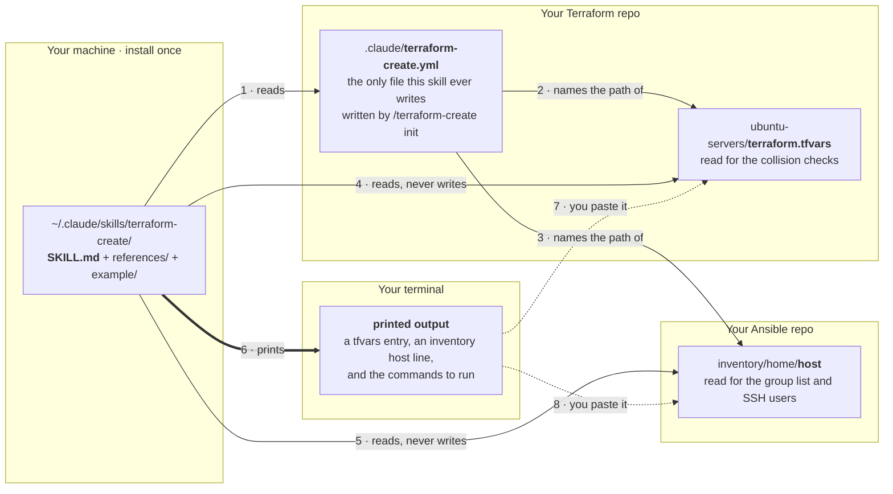
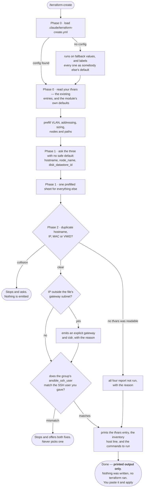

# terraform-create

Walks you through defining one new Ubuntu VM on Proxmox and hands back two blocks of text:
an entry for the `servers` variable in your Terraform tfvars, and a host line for the
matching Ansible inventory. You paste both and run terraform yourself.

**Output only.** In every mode, `init` included, it never edits your `terraform.tfvars`,
your Ansible inventory, or any `.tf` file, and never runs a terraform or ansible command —
not `apply`, not `plan`, not even `validate`. Reading files is how the collision checks work;
that's the extent of it. The one carve-out: `/terraform-create init` writes and commits
exactly one file, `.claude/terraform-create.yml` — this skill's own config, in your repo,
shown to you before it's committed.

> ⚠️ **Ships one homelab's values as fallbacks.** With no config present it prefills VLAN 100,
> 2 cores, 4096 MB, 40 GB and `192.168.<vlan>.x`, and says out loud that those are somebody
> else's defaults. **`/terraform-create init` replaces every one of them with yours** — see
> [Configuration](#configuration) and [The fallbacks, and what replaces
> them](#the-fallbacks-and-what-replaces-them).

---

## Before you start

This skill **reads** your Terraform repo and **prints** an entry to paste. It does not build
a Terraform module, and it does not apply anything.

| | Why |
|---|---|
| A Terraform config with a `servers`-style variable, and its `terraform.tfvars` | It's what the entry gets pasted into, and what the collision checks read. No tfvars → every check reports *not run* |
| Claude Code, for the checks | The checks need to read real files. It still answers in claude.ai chat — it just skips the checks and says so |
| `git` and `gh` (or a GitHub MCP server) with write access — **`init` only** | `init` commits the config and opens a PR. An ordinary run needs neither |
| The Ansible repo — optional | Lets it read your real group list, and cross-check the SSH user you gave against the group's `ansible_ssh_user` |

No terraform, ansible or Proxmox CLI is needed anywhere, because nothing is executed.

**The tfvars is normally gitignored**, so a fresh clone won't have it. That's expected and
handled — but it's also the thing that silently disables every duplicate check, so the skill
names it in the report every time rather than letting a quiet skip look like a pass.

Don't have a Terraform module yet? [`example/`](example/) is a complete working one — see
[Starting from scratch](#starting-from-scratch--the-bundled-example-module).

---

## Where the files go

Four places in the picture, and exactly one file among them that this skill ever writes:



- **The skill** is a folder you copy once. It is the same for every environment.
- **The config** is one small YAML file in your Terraform repo, and it's the only
  environment-specific thing that exists. `init` writes it.
- **Your tfvars and your inventory** are read and never modified. The dotted arrows are you,
  pasting — not the skill.

---

## Install

### Step 1 — copy the skill

```bash
git clone https://github.com/dawg-io/claude-skills.git
cd claude-skills

# personal — available in every project (recommended)
mkdir -p ~/.claude/skills
cp -r terraform-create ~/.claude/skills/

# or project-scoped — checked in alongside the Terraform repo it serves
mkdir -p /path/to/your-terraform-repo/.claude/skills
cp -r terraform-create /path/to/your-terraform-repo/.claude/skills/
```

Start a new Claude Code session — skills are picked up at session start, not live. Confirm it
loaded by typing `/` and looking for `terraform-create` in the list.

### Step 2 — teach it your environment

From inside your Terraform repo:

```
/terraform-create init
```

It reads your repo rather than quizzing you: finds your tfvars, works out which variable
holds the servers and whether it's a list or a map, pulls the node names and datastores
already in use, infers the addressing convention from the IPs that are already there, reads
your module's `default_*` values, finds your Ansible inventory, and offers all of it back as
defaults you confirm or correct.

Then it writes `.claude/terraform-create.yml`, shows it to you in full, **validates what it
recorded by reading the files** — never by running terraform — commits that one path on a
branch cut from your default branch, and opens a PR. It merges that PR only if you say yes.

You can write the file by hand instead — see [Configuration](#configuration) — but `init`
derives the servers variable name, its shape and your real addressing from the actual file,
which is the part that's easy to get wrong and quietly expensive to get wrong: a config
pointing at a tfvars that isn't there disables every collision check without failing.

### Step 3 — add a VM

```
/terraform-create
```

Works with or without the config. Without it you get one homelab's fallbacks, clearly
labelled as such on the sheet and in the report.

---

## What a real run looks like



The run ends where it starts: in your terminal. Every arrow out of it is you.

From your seat, a clean run asks for your attention twice — once for the three values that
have no safe default, once for the prefilled sheet — and then prints. The three diamonds are
the checks worth having: they're the reason to run this instead of copying the entry above it
in the file and editing the numbers.

### When it stops on you

| It says | What happened | What you do |
|---|---|---|
| **Duplicate name / IP / MAC / VMID** | The value you chose is already in the tfvars | Pick another. It won't hand you an entry that collides |
| **Collision checks: not run** | There's no live tfvars to read — usually a fresh clone, since the file is gitignored | Nothing's broken; nothing was checked either. Get the real tfvars in place before you apply |
| **No gateway is derivable** | You set a static IP, but the file has no `network_gateway` and your config has none | Give it a gateway, or drop the IP and take DHCP |
| **The group's SSH user doesn't match** | Terraform builds a key-only account; the inventory group logs in as someone else, so every play fails at connect | Pick one of the two fixes it offers. It won't pick for you |
| **Servers variable not found** | Your config names a variable that isn't in the file — renamed, or the wrong file | Fix `terraform.servers_variable` or `terraform.tfvars` in `.claude/terraform-create.yml` |
| **The addressing scheme can't produce an address** | Your scheme puts the VLAN in an octet and the VLAN is above 255 | Give it the full IP. It won't emit something that isn't an address |
| **Prefills are one homelab's fallbacks** | There's no config yet | Run `/terraform-create init` |

---

## What it prints

The whole skill exists to hand you the block below, so here is a real one end to end. This
run adds a cache node to a repo that copied the bundled [`example/`](example/) module into
`proxmox/` — so the **values** are all traceable to
[`example/terraform.tfvars.example`](example/terraform.tfvars.example) and you can read along,
while the **paths** are just where that copy happens to live. Yours will differ; `init`
records them.

**What the module already has:** `net_vlan = 100`, `network_gateway = "192.168.100.1"`,
`default_cores = 2`, `default_memory_mb = 2048`, `default_disk_size_gb = 20`, and three
servers — `web01` on DHCP, `db01` at `192.168.100.11`, `edge01` at `192.168.100.5`.

**What you type:**

```
/terraform-create
```

**What it asks.** Twice, and that's all. First the three values that have no safe default:

```
name?              cache01
node_name?         pve01
disk_datastore_id? local-lvm
```

Then one prefilled sheet for everything else, where you change what you want and accept the
rest — here, bumping memory to 4096 and taking `192.168.100.12`.

**What it prints — this is the entire output:**

---

### terraform-create — cache01

**Mode:** full
**Config:** `.claude/terraform-create.yml` loaded
**Target:** `~/infra` @ `main` — `proxmox/terraform.tfvars`: read

**Node:**

| field | value | source |
|---|---|---|
| name | `cache01` | you |
| node_name | `pve01` | you |
| disk_datastore_id | `local-lvm` | you |
| ip | `192.168.100.12` | you |
| net_vlan | `100` | config prefill matches file default — not emitted |
| cores | `2` | file default — not emitted |
| memory_mb | `4096` | you — differs from `default_memory_mb` |
| disk_size_gb | `20` | file default — not emitted |
| groups | `["ubuntu_servers"]` | config prefill |

**tfvars entry** — append inside `servers = [ ... ]` in `proxmox/terraform.tfvars`:

```hcl
{
  name              = "cache01"
  node_name         = "pve01"
  disk_datastore_id = "local-lvm"

  ip = "192.168.100.12"

  memory_mb = 4096

  groups = ["ubuntu_servers"]
},
```

**Ansible inventory** — add to `inventory/hosts` under `[ubuntu_servers]`:

```ini
cache01 ipv4=192.168.100.12
```

**Checks:**
- Duplicate name / ip: passed against 3 existing entries
- Duplicate mac / vmid: not run — neither is pinned on this node
- Gateway matches subnet: `192.168.100.12` is inside `192.168.100.0/24`, gateway `192.168.100.1` — no explicit gateway needed
- Inventory group SSH user: `[ubuntu_servers:vars] ansible_ssh_user=ansible` matches the `ansible` account the module builds

**Next steps — run these yourself:**

```bash
cd proxmox

# 1. syntax
terraform fmt -check && terraform validate

# 2. plan, saved to a file so the apply is exactly what you reviewed
terraform plan -out=tfplan

# 3. apply that saved plan
terraform apply tfplan

# 4. what got built
terraform output -json servers
terraform output -raw ansible_inventory_yaml
```

Expect exactly one resource to be created.

**Risks / follow-up:** none.

---

### What to notice in that

- **`cores`, `disk_size_gb` and `net_vlan` are absent from the entry.** Each matches what the
  file already sets, so they're left out and the entry inherits them. `memory_mb` is there
  because 4096 differs from the file's 2048, and `ip` because the file sets no address. A
  shorter entry is the correct one; anything restating a default is noise you'd have to keep
  in sync later — and on a node that *did* need a different VLAN, `net_vlan` would appear
  right under `ip`.
- **Every field carries its source.** `you`, `config prefill`, `fallback prefill`, or
  `file default`. With no `.claude/terraform-create.yml` yet, that column reads
  `fallback prefill` and the header says the prefills are somebody else's homelab, not yours.
- **`not run` is a real answer.** MAC and VMID weren't pinned, so those two checks say so
  rather than claiming a pass. On a fresh clone with no live tfvars, all four say
  `not run — no tfvars readable`, and the mode drops to `partial`.
- **Nothing was written.** No file changed, no terraform ran. You paste the two blocks and
  run the commands yourself. That's the end of the skill's job.

### When a check fails instead

Same run, but you ask for `192.168.100.11` — which `db01` already has:

---

**Checks:**
- Duplicate ip: **failed** — `192.168.100.11` is already used by `db01` in
  `proxmox/terraform.tfvars`

Stopping before emitting. Pick a different address and run again — `192.168.100.12` is free
among the entries I read.

---

No tfvars entry is printed at all. That's the point of the checks: the entry you get is one
you can paste without reading it twice.

---

## The two modes

| You type | It does | It writes |
|---|---|---|
| `/terraform-create init` | Interviews you, derives what it can from your tfvars, writes `.claude/terraform-create.yml`, opens a PR for it | One file, on a branch, after you've seen it |
| `/terraform-create` | The run: Phases 0–2, then the report | **Nothing at all** |

There's no dry-run mode, because an ordinary run already changes nothing.

Plain `/terraform-create` with no config **does not** route into `init`. It runs on the
fallbacks and offers `init` at the end — asking for a tfvars entry isn't consent to commit a
config file.

### When it triggers

- `/terraform-create`, "terraform create"
- Asking to create / add / spin up / provision a node, VM, server or guest on Proxmox
- Asking for a tfvars entry for a new host — **even without saying "Terraform"**
- "set up terraform-create", "configure terraform-create" → `init`

Not for reviewing an existing plan, changing a server that already exists, or the `homelab/`
Talos cluster, which has its own state.

---

## Configuration

The whole environment-specific surface is one file, in your Terraform repo:

```yaml
version: 1

terraform:
  dir: ubuntu-servers                       # where you run terraform, relative to repo root
  tfvars: ubuntu-servers/terraform.tfvars   # the file read for the collision checks
  servers_variable: servers                 # the variable holding the entries
  servers_shape: list                       # list | map — how entries are keyed

defaults:                                   # interview prefills for a NEW vm
  vlan: 100
  cores: 2
  memory_mb: 4096
  disk_size_gb: 40
  on_boot: true

addressing:
  scheme: "192.168.{vlan}.{octet}"          # or a literal prefix, or omit to always ask
  cidr: 24
  gateway: "192.168.100.1"                   # omit → read network_gateway from the tfvars

proxmox:
  nodes: ["pve01"]                          # offered as choices, never preselected
  datastores: ["local-lvm"]
  template: "noble-server-cloudimg-amd64"   # what the module builds from, for the report

ansible:                                    # omit → no inventory line is emitted
  inventory: ../ansible/inventory/home/host
  format: ini                               # ini | yaml
  default_group: ubuntu_servers
  ssh_user: ansible                         # prefill only — still asked every run
```

Only `version` and `terraform` are required. `defaults`, `addressing`, `proxmox` and
`ansible` are each independently optional; omit one and that block alone falls back to the
bundled values, labelled as a fallback in the report.

Two things the config deliberately does **not** hold:

- **Secrets.** Paths, names and numbers only. Your `pm_api_token` stays in the tfvars, which
  is read for the checks and never quoted back.
- **The next free VMID.** It's derived from the file on every run, because a stored one goes
  stale the moment somebody else adds a VM.

**Precedence, when two sources disagree:** what you say in the interview wins over what the
tfvars says, which wins over the config, which wins over the bundled fallbacks. The config
says what to *propose*; the file says what is *true*. Where the config and the file
contradict each other — the variable was renamed, a node is gone — the skill trusts the file,
names the stale key, and stops.

---

## How it works

### Setup mode — `/terraform-create init`

Confirms `git`/`gh` write access, discovers the repo, and refuses to overwrite a config you
haven't seen. Then the check that actually decides whether this skill is worth anything: **is
there a tfvars to read?** Three answers, each said out loud — a real file (derive from it),
only a `.example` (derive the shape and defaults, record the live path, and warn that until
that file exists every duplicate check is *not run*), or neither (ask where it will be, and
record exactly that — it won't invent a path or write you a module).

Then it derives, rather than asks: the servers variable's name and whether it's a list or a
map, every existing name/IP/MAC/VMID, the node names and datastores in use, the module's
`default_*` values, the addressing convention inferred from the IPs already in the file, the
next free VMID, and the image the module builds from. It asks only what's genuinely
unreadable — your VLAN for new VMs, your sizing prefills, which nodes to offer — and offers
the derived answer for each, so you're correcting rather than composing.

Then: writes the file, shows it in full, and **validates what it recorded before committing**
— the tfvars path resolves, it parses far enough to find the recorded servers variable, the
shape matches, the nodes appear, the inventory exists. That validation is done by *reading*;
`init` runs no terraform command either. A config pointing at a tfvars that isn't there
silently disables every collision check, which is this skill's whole safety value, so it is
checked before the commit rather than discovered on the first real run.

Finally it commits that one path (`git add .claude/terraform-create.yml`, never `-A`) on a
branch cut from the default branch, pushes, opens a PR, and merges it only on an explicit
yes. It stops rather than committing into a dirty tree, and puts you back on the branch you
started on. If `.claude/` happens to be gitignored in your repo, `git add` refuses the file —
it says so and asks whether to un-ignore it rather than reaching for `-f`.

### Phase 0 — Orient, load config, read the tfvars

Tooling, then the repo, then the config, then the file. The config has three outcomes, each
stated before the first question: **found** (echoed back so you can catch a wrong value
before it matters), **absent** (says so, says the prefills are somebody else's, carries on),
or **invalid** (stops and names the key — it won't improvise a config to keep going).

Then the tfvars, landing in one of three run modes:

| Mode | Condition | Behaviour |
|---|---|---|
| **Full** | tfvars found and the servers variable parsed out of it | Every check runs |
| **Partial** | Repo found, no live tfvars | Defaults come from `terraform.tfvars.example`; **collision checks do not run** |
| **Reduced** | No repo, or no tfvars and no example | Interviews and emits from the bundled fallbacks; **nothing is checked against reality** |

It never silently degrades between these, and the mode is the first line of the report.

If the file is there but the configured servers variable isn't in it, that's a stop — it says
which name it looked for and which variables it actually found.

### Phase 1 — Interview

**Step 1 — the three that cannot be prefilled**, asked together in one message: `hostname`
(validated as a lowercase DNS label, never silently normalised), `node_name`, and
`disk_datastore_id`. Your configured nodes and datastores, plus the ones already in the file,
are offered as hints; nothing is preselected.

**Step 2 — the prefilled sheet.** Every remaining field shown as a table with its default
filled in, corrections taken in one reply. **Each prefill says where it came from** — your
config, your tfvars, or a fallback that isn't yours.

The addressing scheme is a template, not arithmetic: `192.168.{vlan}.{octet}` follows the
VLAN, and moving off the default VLAN usually needs an explicit `gateway` too. If the scheme
puts the VLAN in an octet position and the VLAN is above 255, it asks for the full IP instead
of emitting something that isn't an address.

### Phase 2 — Check before emitting

Every check is reported as **passed, failed, or not run** — never assumed:

- **Duplicates** — `name` or `ip` is a hard stop; pinned `net_mac` or `vm_id` too. A
  `node_name` or `disk_datastore_id` seen nowhere else is flagged, not blocked (a typo'd
  datastore fails at apply, long after this skill is done). In Partial or Reduced mode all
  four report *not run*, never "no conflicts found"
- **Addressing** — if the IP's /24 doesn't match the file's `network_gateway`, the entry
  needs an explicit `gateway`, emitted with the reason. If no gateway resolves at all, that's
  a stop
- **Sizing** — `cores`, `memory_mb` and `disk_size_gb` are written out explicitly whenever
  they differ from the file's actual `default_*`, and only then. A config whose prefills match
  your module defaults produces a shorter entry, and that's correct
- **Ansible reachability — the one that bites.** Terraform creates a key-only account named
  by `username` with root and password login disabled, while a static inventory usually sets
  its own `ansible_ssh_user` per group. Drop a new VM into such a group and every play fails
  at connection before any task runs. **The SSH user is asked on every run** — never inferred
  from a group name — and your real inventory's `:vars` is read only to cross-check that
  answer. On a mismatch it offers both honest fixes — a per-host `ansible_ssh_user` override,
  or a new group with its own `:vars` — without picking one

### Reporting

A fixed report every run: mode, which config was used and where it came from, the target repo
and tfvars, a field-by-field table with the source of each value, the `hcl` tfvars entry (keyed by name
if your servers variable is a map), the inventory host line, the check results, and the exact next commands filled in with your real
directory — `fmt -check && validate`, `plan -out=tfplan`, `apply tfplan`, then the outputs.
Handing over the exact command is the point of stopping here; making you reconstruct it is
not.

---

## Bundled references

Both are **illustrative examples, not a description of any real network**; your repo wins on
every disagreement, the drift is reported, and `.claude/terraform-create.yml` replaces them.

- **`references/tfvars-schema.md`** — the full `servers` entry attribute table, module-level
  defaults, which edits are destructive (cloud-init only runs on first boot, so changing a
  server's IP means destroy-and-recreate), and known troubleshooting signals
- **`references/ansible-inventory.md`** — the two INI line formats, and the SSH-user mismatch
  in full. It carries no group names and no SSH users of its own, by design

## Starting from scratch — the bundled example module

This skill emits entries for a Terraform module it assumes already exists. If you don't have
one, **[`example/`](example/) is a complete working configuration** you can copy into your own
repo and adapt: Proxmox provider, cloud image download, per-guest cloud-init snippets, the VM
resource, and a generated Ansible inventory.

It implements exactly the schema in `references/tfvars-schema.md`, so what the skill prints
pastes straight in. `example/README.md` covers the four Proxmox prerequisites that produce
confusing errors when missed, and records what was and wasn't verified.

```bash
cp -r terraform-create/example ~/my-infra/proxmox && cd ~/my-infra/proxmox
cp terraform.tfvars.example terraform.tfvars   # then fill in endpoint, token, SSH key
terraform init && terraform validate
```

The skill won't do any of this for you — writing a module is `/code-development`'s job, not
this one's.

## The fallbacks, and what replaces them

With no `.claude/terraform-create.yml`, the skill runs on the illustrative values below and
says so. `/terraform-create init` records yours instead. Nothing below needs editing inside
the skill folder:

| Fallback | Where it's written down | Config key that replaces it |
|---|---|---|
| `ubuntu-servers/terraform.tfvars` | The config example in `SKILL.md`, both references | `terraform.tfvars`, `terraform.dir` |
| The variable named `servers`, as a list | `SKILL.md` Phase 0, `tfvars-schema.md` | `terraform.servers_variable`, `terraform.servers_shape` |
| VLAN 100, `192.168.100.0/24`, gw `192.168.100.1` | `SKILL.md` Phase 1, `tfvars-schema.md` | `defaults.vlan`, `addressing.*` |
| 2 cores / 4096 MB / 40 GB | `SKILL.md` Phase 1 table | `defaults.cores`, `defaults.memory_mb`, `defaults.disk_size_gb` |
| Node `pve01`, bridge `vmbr0` | `tfvars-schema.md` | `proxmox.nodes`; the bridge is read from your tfvars |
| DNS `192.168.100.1`, domain `example.lan` | `tfvars-schema.md` | read from your tfvars (`dns_servers`, `search_domain`) |
| `inventory/home/host`, INI not YAML | `SKILL.md`, `ansible-inventory.md` | `ansible.inventory`, `ansible.format` |

The *structure* — output-only, one prefilled sheet, four collision checks, the SSH-user
reachability check — is what's worth keeping. The values were never the point.

---

## Hard rules

1. **Output only, with exactly one carve-out** — no file writes, no terraform or ansible
   execution of any kind. The one exception is `init` writing and committing
   `.claude/terraform-create.yml`, after you've seen it; that's this skill's own config, never
   your tfvars, inventory or `.tf` files
2. **Never guess a required value** — `name`, `node_name` and `disk_datastore_id` have no safe
   default
3. **Never print a secret** — `terraform.tfvars` holds `pm_api_token` and may hold SSH keys;
   it's read for the checks and never quoted back, and the config file holds no secrets at all
4. **Never claim a check ran when it did not** — `"not run — no tfvars at <path>"` is a
   correct answer
5. **The config is the contract; the tfvars is the truth** — where they disagree, it names the
   stale key and stops

## What it will never do

- Edit `terraform.tfvars`, your Ansible inventory, or any `.tf` file — in any mode, `init`
  included
- Commit anything but `.claude/terraform-create.yml`, push to the default branch, `git add -A`,
  or merge the config PR without an explicit yes
- Run `terraform apply`/`plan`/`validate`/`fmt`/`init`/`import`, or anything touching state —
  including "just a plan to check", which takes a state lock and talks to the Proxmox API, and
  including inside `/terraform-create init`
- Run `ansible-playbook` in any form, `--check` included
- Modify an existing server entry or a module-level `default_*`
- Touch `homelab/` — separate config, separate state, Talos not Ubuntu
- Invent a `node_name`, datastore, MAC, VMID, tfvars path or inventory path
- Write a Terraform module, a variables file, or CI to make its own prerequisites exist
- Put a token, key or password in the config file
- Reflow or "tidy" the rest of the tfvars
- More than one node per run — batching is how a wrong datastore gets copied four ways

## Output

A fixed report: the mode (full / partial / reduced / setup), which config was used and where
it came from, the target repo and tfvars, the field-by-field table with each value's source,
the tfvars entry, the inventory host line, every check as passed / failed / not run, the exact
commands to run next, and risks/follow-up. `"not run — <reason>"` is an accepted answer; a
fabricated "no conflicts found" is called out in the skill as the one failure mode that makes
it worse than doing the work by hand.

No terraform output ever appears in the report, because no terraform command is run.

A complete worked example of that report — with the tfvars entry, the inventory line, the
checks and the commands, filled in for a real node — is in
[What it prints](#what-it-prints).

## Note for editors

The `description` in the frontmatter is **1016 of the 1024 available characters**. Any
addition needs a matching cut.
